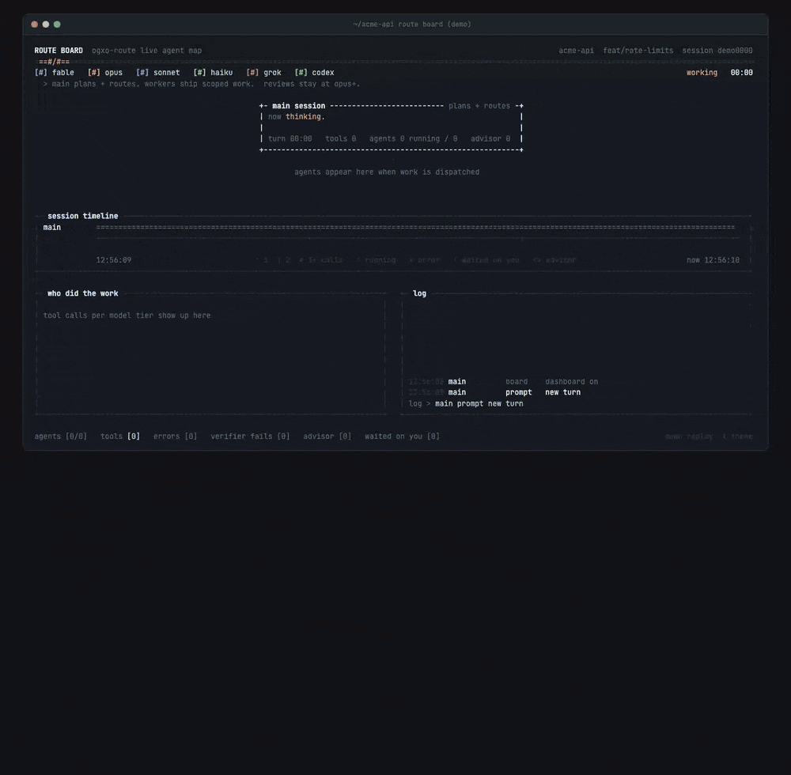

# ogxo plugins

Marketplace for ogxo tools in Claude Code, Grok Build, and Codex.

## Install

The recommended way is the **ogxo bundle**: one plugin that installs the rest.

```bash
claude plugin marketplace add ogxo-io/plugins
claude plugin install ogxo@ogxo
```

It installs every plugin in the table below except two, which you add by name when you want them: **thryx** needs a ThryX account and one MCP server per workspace, added with `/thryx:connect`, and **ogxo-format** reformats every file Claude edits. When a plugin joins the set, updating the bundle installs it. To remove everything, uninstall `ogxo@ogxo` and then run `claude plugin prune`. **ogxo-statusline** turns on with `/ogxo-statusline:setup`.

To pick plugins yourself instead, install them by name:

```bash
claude plugin marketplace add ogxo-io/plugins
for plugin in ogxo-git ogxo-review thryx; do
  claude plugin install "$plugin@ogxo"
done
```

Or use the install script, which adds the marketplace (or updates it when it's already added) and installs or updates each plugin. `--all` installs the bundle; `--include-thryx` and `--include-format` add those two on top.

```bash
curl -fsSL https://raw.githubusercontent.com/ogxo-io/plugins/main/install.sh | bash -s -- --list
curl -fsSL https://raw.githubusercontent.com/ogxo-io/plugins/main/install.sh | bash -s -- ogxo-git ogxo-review
curl -fsSL https://raw.githubusercontent.com/ogxo-io/plugins/main/install.sh | bash -s -- --all
```

[`install.sh`](install.sh) only runs `claude plugin` commands and needs `jq`; read it before piping it to bash.

## Update

Auto-update is off by default for third-party marketplaces like this one, so refresh the catalog, then update each installed ogxo plugin (`jq` lists them):

```bash
claude plugin marketplace update ogxo
for id in $(claude plugin list --json | jq -r '.[].id | select(endswith("@ogxo"))' | sort -u); do
  claude plugin update "$id"
done
```

To update one plugin, run `claude plugin update <plugin>@ogxo`. Running the install script again with the same plugin names also refreshes the catalog and updates them.

From inside a Claude Code session:

```text
/plugin marketplace update ogxo
/plugin
```

In the `/plugin` panel, open the **Installed** tab, press **Enter** on each ogxo plugin, and choose **Update now**. Closing the panel runs `/reload-plugins` for you. To update them all at once instead, run the shell loop as one line with the `!` prefix, then `/reload-plugins`:

```text
! claude plugin marketplace update ogxo && for id in $(claude plugin list --json | jq -r '.[].id | select(endswith("@ogxo"))' | sort -u); do claude plugin update "$id"; done
/reload-plugins
```

An open session keeps the versions it loaded: run `/reload-plugins` in it to apply an update made from your shell, or start a new session. To have Claude Code update the plugins itself, run `/plugin`, open the **Marketplaces** tab, select `ogxo`, and choose **Enable auto-update**.

## Plugins

| Plugin | What it is | Status |
|---|---|---|
| `ogxo` | The bundle: installs every plugin below except `thryx` and `ogxo-format`. No skills or hooks of its own. | 0.1.3 |
| `thryx` | Skills for the hosted ThryX MCP server, vendored in this repo (`plugins/thryx`): issues, projects, cycles, milestones, and documents. `/thryx:connect <workspace>` connects each ThryX workspace as its own MCP server (on macOS the token goes into your Keychain through a dialog), so one install covers several companies. | 0.3.0 |
| `ogxo-review` | Multi-agent code review: `/ogxo-review:full-review` cross-correlates reviewers and filters false positives; `/ogxo-review:code-review-git` posts line-level findings as a GitHub PR review and answers other reviewers' comments. Bundles the code-review-agent, security-auditor, code-metrics-analyst, dependency-auditor, and finding-verifier agents (code-review-git verifies every finding before it is shown); `/ogxo-review:security-check` for a focused security pass. | 0.3.1 |
| `ogxo-git` | Conventional Commit messages, PR titles/descriptions with template detection, resolving PR review threads (its workflow instructs it to present its analysis and wait for approval before replying or resolving), `/ogxo-git:catchup` to restore branch context, plus release, quick-fix, and ship-feature workflows and changelog/release-notes skills. | 0.2.5 |
| `ogxo-debug` | `live-debug`: reproduce a web-app bug in the browser, read console and network errors, fix, and verify in the page; `css-alignment-debug` injects temporary outline overlays and reads a screenshot to find stubborn layout bugs. Also `browser-testing` for Playwright test scripts. | 0.3.4 |
| `ogxo-decide` | `war-room`: multi-persona deliberation for hard-to-reverse decisions — game-theory lenses, red-team pass, a portfolio of options rather than a single winner; `prd-create` (PRDs, optionally saved to ThryX), `task-architect`, and the architecture-advisor agent. Also `diagram-generator` for Mermaid diagrams. | 0.3.4 |
| `ogxo-design` | `recolor`: audit an app's colors and implement an accessible, token-based color system, with contrast ratios computed by a bundled script. | 0.1.1 |
| `ogxo-guards` | Hooks that reject a `git add` whose pathspecs, or for broad adds the files git status lists, include .env, key, certificate, or credentials files, Edit/Write calls on lock files and node_modules/vendor/.git paths, and single writes over 1,048,576 characters. Pattern-based; see its README for what each does not catch. Requires `jq`. | 0.2.0 |
| `ogxo-format` | Hooks that format each edited file with prettier, gofmt, rustfmt, or black when found, report trailing whitespace back to Claude, and check YAML syntax. Opt-in: auto-format rewrites whole files. Requires `jq`. | 0.1.1 |
| `ogxo-specialists` | Subagents that take a noisy job and return one structured report: `log-analyst` (logs → root cause), `codebase-archaeologist` (map a legacy system), `performance-optimizer` (measure, fix by impact, re-measure), `migration-specialist` (breaking changes, phased plan with rollback points). | 0.1.4 |
| `ogxo-statusline` | Status line for Claude Code and Grok Build: model, context use, git branch and changes, session time, effort, output tokens, and session cost. Claude Code also shows thinking, prompt-cache state, and 5-hour / 7-day usage bars. Grok Build uses the live context window, session output and cache-read share, and the active turn. `/ogxo-statusline:setup` installs the Claude line; `/ogxo-statusline:setup-grok` installs the Grok line. Requires `jq`. | 0.2.4 |
| `ogxo-route` | Cost-aware routing for Claude Code: a routing skill and session-start summary, Sonnet/Haiku worker subagents (scout, test-runner, verifier, implementer, implementer-risky, log-extractor, e2e-runner), and hooks that warn on generic subagents dispatched without a model, log each dispatch and permission request, and count advisor calls (`/ogxo-route:stats`). Opt-in: desktop or push alerts when Claude Code waits on a permission prompt (`/ogxo-route:alerts`), and a live HTML board of a session's agents and tool calls (`/ogxo-route:dashboard`). Risky work and reviews stay at Opus or above. Warns, never blocks. Requires `jq`. | 0.5.1 |

Plugins backed by a product (an MCP server or binary) pin to a release tag and
commit sha in that product's repository. Content-only plugins — skills, agents,
and commands with no product behind them — are vendored here under `plugins/`.

## The live board

`/ogxo-route:dashboard` opens a live page of everything a session is doing: the agents it dispatched and on which model, their tool calls, failed calls with their errors, tokens and list-price cost per worker, and, with ogxo-statusline installed, how much of your plan's 5-hour and weekly windows is left. `/ogxo-route:dashboard serve` makes it reachable over HTTP on this machine. Details are in the [ogxo-route README](plugins/ogxo-route/README.md#live-board).



## License

MIT — see [LICENSE](LICENSE). Each vendored plugin ships its own copy.
