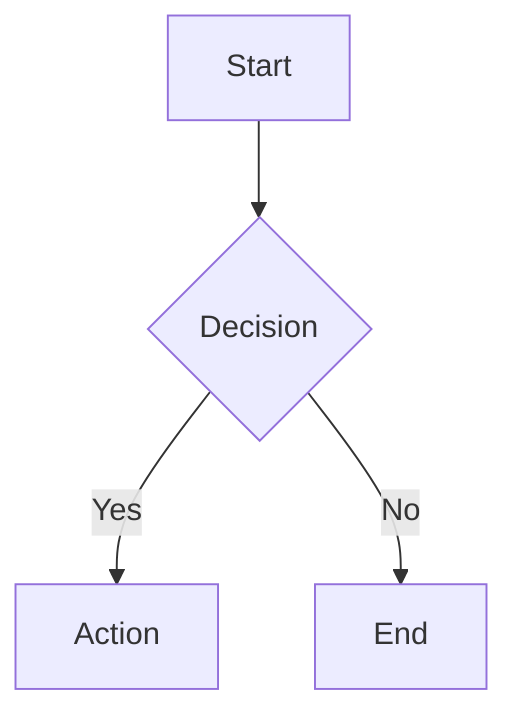

# Diagram Generator

## Overview

Generates Mermaid diagrams in two modes:

- **Describe mode**: User describes what they want; skill generates the diagram
- **Analyze mode**: Skill reads codebase files to auto-generate architecture, dependency, class, ER, and data flow diagrams

Output is always valid Mermaid syntax inside a fenced code block, ready to render on GitHub, GitLab, VS Code, Obsidian, or any Mermaid-compatible platform.

For a full codebase architecture (20+ components) or a multi-diagram set, produce the overview first, then one detail diagram per `«detail»` block (see Component Decomposition below).

## Workflow Decision Tree

```
User request
    ↓
Mode Detection
    ├─ User describes what to draw → DESCRIBE MODE
    │   └─ "draw a flowchart of the login process"
    │   └─ "create a sequence diagram for checkout"
    │   └─ "make an ER diagram with users, orders, products"
    │
    └─ User wants diagram from code → ANALYZE MODE
        └─ "diagram the architecture of this project"
        └─ "generate a class diagram from src/"
        └─ "show me the dependency graph"
        └─ "visualize the API endpoints"
    ↓
Select Diagram Type (see table below)
    ↓
Generate Mermaid Code
    ↓
Present & Iterate
```

## Supported Diagram Types

| Type | Best For | Syntax Reference |
|------|----------|-----------------|
| **Flowchart** | Processes, decision trees, workflows | `references/mermaid-syntax-core.md` |
| **Sequence** | API calls, message passing, request/response flows | `references/mermaid-syntax-core.md` |
| **Class** | OOP structures, interfaces, inheritance hierarchies | `references/mermaid-syntax-core.md` |
| **ER** | Database schemas, data models, table relationships | `references/mermaid-syntax-core.md` |
| **State** | State machines, lifecycle management, status flows | `references/mermaid-syntax-extended.md` |
| **Gantt** | Project timelines, task scheduling, milestones | `references/mermaid-syntax-extended.md` |
| **Mindmap** | Brainstorming, concept mapping, topic hierarchies | `references/mermaid-syntax-extended.md` |
| **Pie** | Distribution, proportions, composition breakdowns | `references/mermaid-syntax-extended.md` |
| **Git Graph** | Branch strategies, release flows, merge patterns | `references/mermaid-syntax-extended.md` |
| **C4 Context** | System-level architecture, external integrations | `references/mermaid-syntax-extended.md` |

## Architecture Diagram Quality Principles

**Golden rule: clarity over completeness.** A diagram that clearly shows the 15 most important components is more valuable than one that shows all 40 components in an unreadable mess.

### Type-Specific Node Limits

| Diagram Type | Ideal Range | Max Before Split |
|-------------|-------------|-------------------|
| Architecture/Flowchart (system) | 15-20 | 20 |
| C4 Context | 8-12 | 12 |
| Flowchart (process) | 20-25 | 30 |
| Sequence | 6-8 participants | 10 |
| Class | 8-12 | 15 |
| ER | 10-15 | 20 |

### Subgraph Organization

- Use a few subgraphs, one per architectural layer or domain
- If a subgraph grows large enough to crowd the layout, split it or collapse part of it into a `«detail»` node
- Name subgraphs by their purpose: "Clients", "API Layer", "Services", "Data Layer"
- Apply light fill colors to subgraphs to visually separate layers (see `references/output-formatting.md`)

### Component Decomposition

When a block has significant internal complexity (6+ internal components), collapse it in the overview and present a separate detail diagram:

- **Overview diagram** -- Show the complex block as a single node labeled `«detail»` (e.g., `["Order Service «detail»"]`)
- **Detail diagram** -- A standalone diagram expanding that block's internals (5-7 nodes)
- Use the same `classDef` colors across overview and detail diagrams for visual continuity
- Present the overview first, then offer to generate detail diagrams for any block

See Pattern 4 in `references/output-formatting.md` and Example 13 in `references/diagram-examples.md`.

### Edge Crossing Minimization

- **Unidirectional flow** -- Arrange nodes so edges flow in one direction (TD or LR), not back and forth
- **Interface nodes** -- Connect subgraphs through a single interface node (e.g., API Gateway) instead of many direct cross-subgraph connections
- **Limit cross-subgraph connections** -- If one subgraph connects to many nodes in another, consider using a single grouped edge (e.g., `Services -->|queries| DB`)
- **Define edges outside subgraphs** -- Mermaid produces better layouts when edges are at the top level

### Color Coding

Apply the architecture color palette from `references/output-formatting.md` when a diagram has 3+ component types, and include a legend subgraph so readers can decode the colors.

### Architecture Diagram Checklist

Before presenting an architecture diagram, verify:

- [ ] Node count is within the type's limit (table above), or the diagram is split
- [ ] Nodes are organized into subgraphs by layer or domain
- [ ] Color classes are applied with `classDef` when there are 3+ component types, with a legend subgraph
- [ ] Edges carry short labels
- [ ] No node is a hub with so many connections that it should be a layer or be abstracted
- [ ] Edges are defined outside subgraphs
- [ ] Flow is predominantly unidirectional
- [ ] Complex blocks (6+ internals) are collapsed with `«detail»` label and expanded in separate diagrams

## Describe Mode Workflow

### Step 1: Understand the Request

Parse what the user wants to visualize:
- **What entities/steps are involved?**
- **What relationships connect them?**
- **Is there a flow direction or hierarchy?**
- **What level of detail is appropriate?**

If the request is ambiguous, ask:
- What are the main components or steps?
- Should this show sequence over time, or structural relationships?
- Any specific entities to include or exclude?

### Step 2: Select Diagram Type

Match the request to the correct diagram type before generating — the wrong type produces misleading visualizations.

Match the request to the best diagram type:

- **Process with decisions** → Flowchart
- **Interactions over time** → Sequence
- **Object structure with methods** → Class
- **Database tables with relationships** → ER
- **States and transitions** → State
- **Timeline with tasks** → Gantt
- **Hierarchical concepts** → Mindmap
- **Proportions/percentages** → Pie
- **Branch/merge strategy** → Git Graph
- **High-level system boundaries** → C4 Context

### Step 3: Generate Diagram

1. For less common types (C4, git graph, mindmap, Gantt) or when unsure of a construct, consult the syntax reference (`references/mermaid-syntax-core.md` or `references/mermaid-syntax-extended.md`)
2. Choose directionality (TD for hierarchies, LR for flows) - see `references/output-formatting.md`
3. Write valid Mermaid syntax
4. Keep node count within type-specific limits (see Architecture Diagram Quality Principles above)
5. Use descriptive labels on nodes and edges
6. Group related nodes with subgraphs where appropriate
7. **For architecture diagrams**: organize nodes into layered subgraphs, apply the color palette from `references/output-formatting.md`, add a legend subgraph, and define edges outside subgraphs

### Step 4: Present and Iterate

1. Output the diagram in a fenced Mermaid code block
2. Briefly explain the diagram structure
3. Offer to adjust: add/remove nodes, change layout, split into sub-diagrams
4. **For architecture diagrams with `«detail»` nodes**: offer to generate detail diagrams that expand specific blocks

## Analyze Mode Workflow

### Step 1: Determine Scope

Ask or infer what to analyze:
- **Full architecture** → Scan project structure, entry points, major modules
- **Dependencies** → Parse package files (package.json, go.mod, Cargo.toml, requirements.txt)
- **Class structure** → Scan source files for classes, interfaces, inheritance
- **Data model** → Look for DB schemas, ORM models, migration files
- **API flow** → Find route definitions, controllers, middleware
- **Data flow** → Trace from input to output through handlers and services

### Step 2: Scan Codebase

Read the actual source code before generating; file names alone mislead about architecture.

1. **Identify the tech stack** - Check for framework config files, package manifests
2. **Find structural patterns** - Search for entry points, route definitions, models, and schemas
3. **Extract relationships** - Parse imports, inheritance, function calls, route definitions
4. **Build a mental model** - Map entities and their connections

### Step 3: Build Diagram Model

From the scan results, construct:
- **Nodes**: Modules, classes, services, tables, endpoints
- **Edges**: Dependencies, inheritance, API calls, data flow, foreign keys
- **Groups**: Subgraphs for layers (controllers, services, repos) or domains

**Trimming guidance**: If the scan produces more nodes than the type-specific limit, prioritize the most architecturally significant components. Merge implementation-detail services into their parent layer, use grouped edges (e.g., `Services --> DB`) instead of individual connections, and offer to drill into specific areas in follow-up diagrams.

**Layout strategy**: Choose a layout pattern from `references/output-formatting.md` (Layered, Domain-Based, or Hub-and-Spoke) based on the codebase structure discovered in Step 2.

### Step 4: Generate and Present

1. Select the best diagram type for the analysis (or multiple types if the scope warrants it)
2. Consult the syntax references for less common types or when unsure of a construct
3. Apply formatting rules from `references/output-formatting.md`
4. Generate the Mermaid code
5. Explain what was found and how the diagram maps to the codebase
6. Offer to drill into specific areas, generate detail diagrams for `«detail»` blocks, or produce additional diagram types

## Output Format

Always output diagrams as fenced Mermaid code blocks:

````

````

For complete examples of each diagram type, consult `references/diagram-examples.md`.

## ❌ Common Mistakes to Avoid

### Mistake 1: Generating Diagrams Without Reading Code First

**Wrong:**
```
User: "Diagram the architecture of this project"
Assistant: *looks at directory names and package.json, then generates a diagram guessing the architecture from file paths alone*
```

**Correct:**
```
User: "Diagram the architecture of this project"
Assistant: *reads entry points, config files, route definitions, and key source files to understand actual architecture, imports, and data flow — then generates an accurate diagram based on real code relationships*
```

**Why it matters:** Guessing architecture from file names produces inaccurate diagrams that mislead developers. A `services/` folder might contain a single helper, not a microservice. Always read actual source code to understand real relationships before generating.

### Mistake 2: Choosing the Wrong Diagram Type

**Wrong:**
```
User: "Show me how the checkout process works"
Assistant: *generates a class diagram showing checkout-related classes and their methods*
```

**Correct:**
```
User: "Show me how the checkout process works"
Assistant: *recognizes "process" implies sequential steps and interactions — generates a sequence diagram showing the user, cart service, payment API, and order service communicating over time*
```

**Why it matters:** The wrong diagram type obscures the information the user needs. A class diagram shows structure but not behavior. A sequence diagram shows behavior but not inheritance. Match the type to what the user is trying to understand: "how it works" = sequence/flowchart, "how it's structured" = class/ER, "what states exist" = state diagram.

### Mistake 3: Making Overly Complex Diagrams

**Wrong:**
```
User: "Visualize our API architecture"
Assistant: *generates a single diagram with 35 nodes, 50+ edges, crossing connections everywhere — technically complete but unreadable*
```

**Correct:**
```
User: "Visualize our API architecture"
Assistant: *generates a clean overview with 15 key components grouped into 4 subgraphs, marks complex blocks with detail labels, then offers: "Would you like me to expand any of these blocks into a detail diagram?"*
```

**Why it matters:** A diagram with too many nodes becomes visual noise. The goal is clarity, not completeness. Keep architecture diagrams to 15-20 nodes max, use subgraphs to organize layers, and split complex areas into detail diagrams that users can drill into.

## Edge Cases

- **Very large codebase**: Focus on top-level architecture first; offer to drill into specific modules
- **No clear structure**: Fall back to a simple flowchart or mindmap of discovered components
- **Mixed diagram needs**: Generate multiple diagrams rather than cramming everything into one
- **Ambiguous request**: Ask the user whether they want structural (class/ER) or behavioral (sequence/state/flowchart) views
- **Monorepo**: Treat each package/app as a separate scope; show inter-package dependencies at the top level
- **No source code available**: Switch to Describe mode and work from the user's verbal description
- **Architecture diagram too complex (>20 nodes)**: Split into sub-diagrams by layer or domain; merge low-level services into their parent layer
- **Simple diagram too complex (>30 nodes)**: Split by layer, domain, or module
- **Many crossing edges**: Reorganize into subgraphs, use interface nodes to reduce cross-connections, and apply the architecture layout patterns from `references/output-formatting.md`

## Quick Reference Checklist

When a user wants a diagram, complete these steps IN ORDER:

- [ ] **Step 1:** Detect mode (Describe vs Analyze)
- [ ] **Step 2:** Select diagram type from the supported types table
- [ ] **Step 3:** Consult the syntax reference for less common types or when unsure
- [ ] **Step 4:** Generate valid Mermaid code (respect type-specific node limits)
- [ ] **Step 4b:** For architecture diagrams: apply subgraph organization, color palette, edge labels, and legend (see Architecture Diagram Quality Principles)
- [ ] **Step 5:** Present in a fenced code block with brief explanation
- [ ] **Step 6:** Offer iteration (adjust layout, add detail, split into sub-diagrams)

## Resources

This skill uses progressive disclosure - references load on-demand to reduce context usage.

### references/

- `mermaid-syntax-core.md` - Syntax for flowchart, sequence, class, ER diagrams
- `mermaid-syntax-extended.md` - Syntax for state, Gantt, mindmap, pie, git graph, C4
- `diagram-examples.md` - 13 complete working examples (one per type + architecture patterns)
- `output-formatting.md` - Directionality, theming, styling, complexity limits

## Version

1.0.0
