# Diagram Examples

Thirteen complete, working Mermaid examples covering all supported diagram types plus architecture-specific patterns. Each includes context on when to use it. The domains and content are illustrative — build diagrams from the user's request or codebase, not from these examples.

## 1. Flowchart -- User Registration Process

**When to use:** Processes with decisions, branching logic, step-by-step workflows.

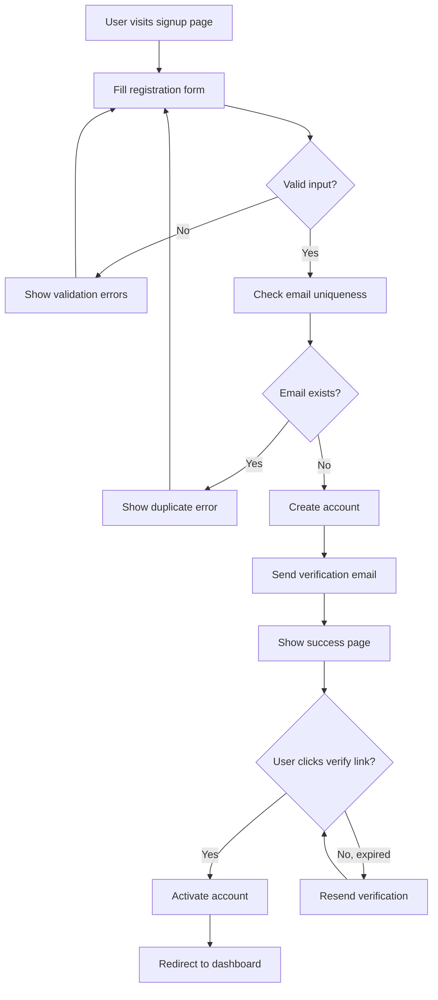

## 2. Sequence Diagram -- REST API Authentication Flow

**When to use:** Interactions between components over time, request/response flows, API call chains.

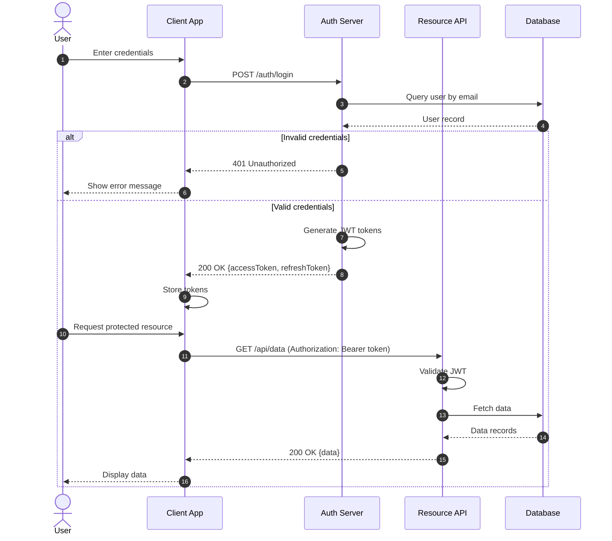

## 3. Class Diagram -- E-commerce Domain Model

**When to use:** Object-oriented structures, interfaces, inheritance hierarchies, type relationships.

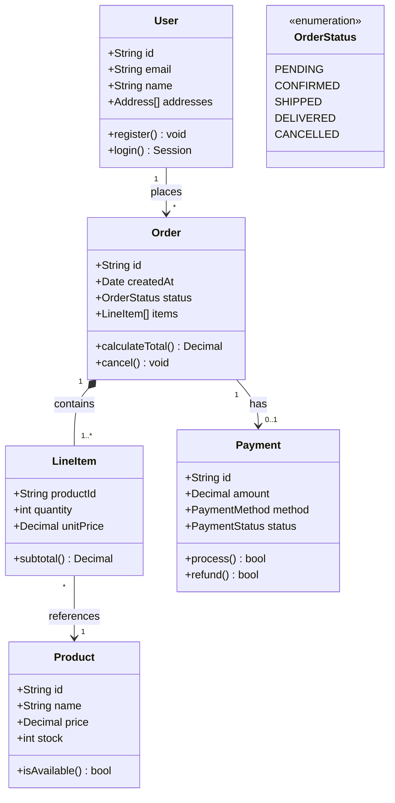

## 4. ER Diagram -- Blog Platform Database

**When to use:** Database schemas, data models, table relationships with cardinality.

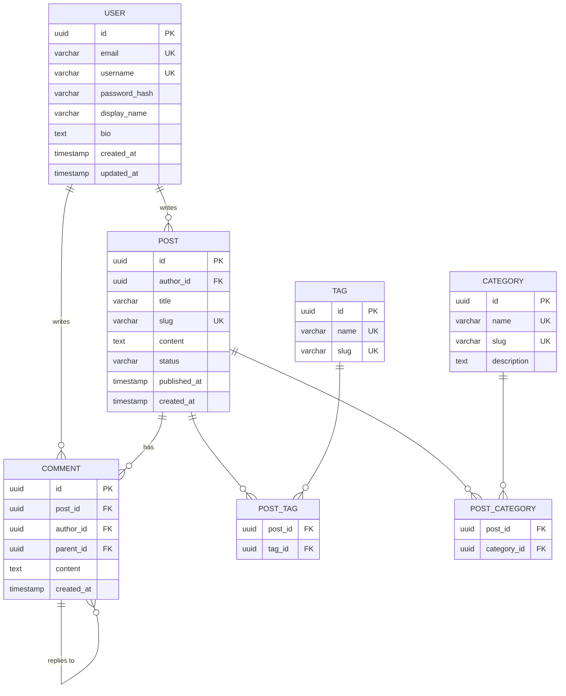

## 5. State Diagram -- Order Lifecycle

**When to use:** State machines, object lifecycles, status transitions with triggers.

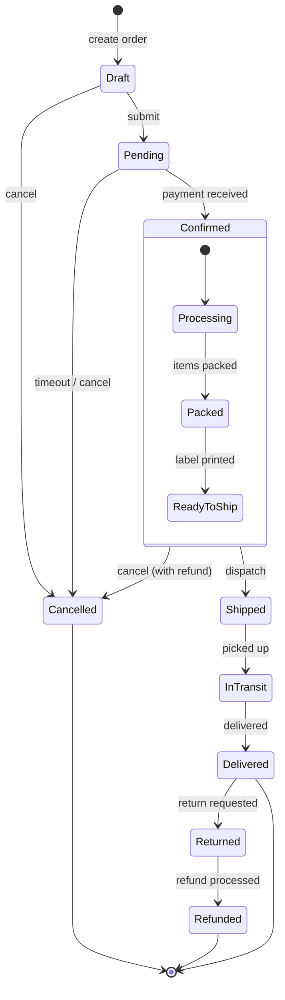

## 6. Gantt Chart -- Sprint Planning

**When to use:** Project timelines, task scheduling, milestones, team workload visualization.

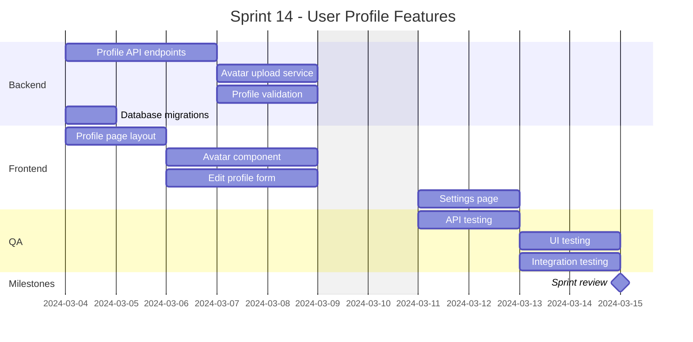

## 7. Mindmap -- Microservices Architecture

**When to use:** Hierarchical overviews, brainstorming, concept mapping, technology landscapes.

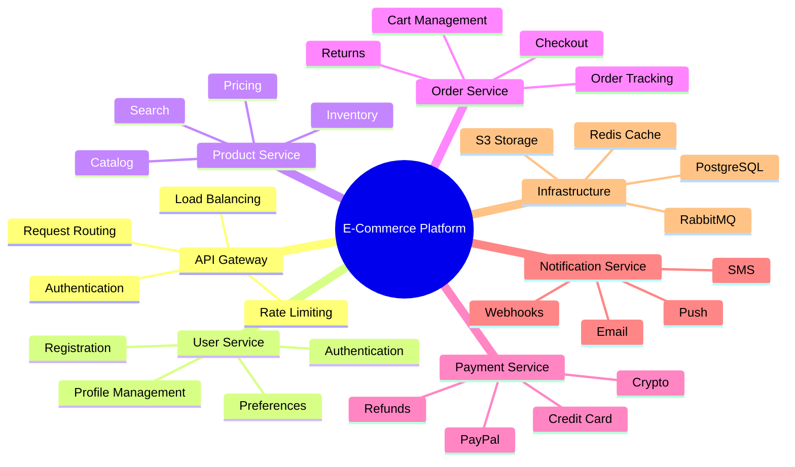

## 8. Pie Chart -- Code Language Distribution

**When to use:** Proportional breakdowns, composition analysis, distribution visualization.

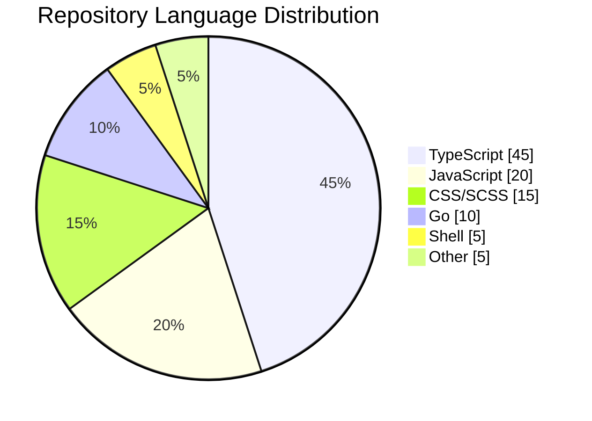

## 9. Git Graph -- Release Branching Strategy

**When to use:** Git workflows, branching strategies, release processes, merge patterns.

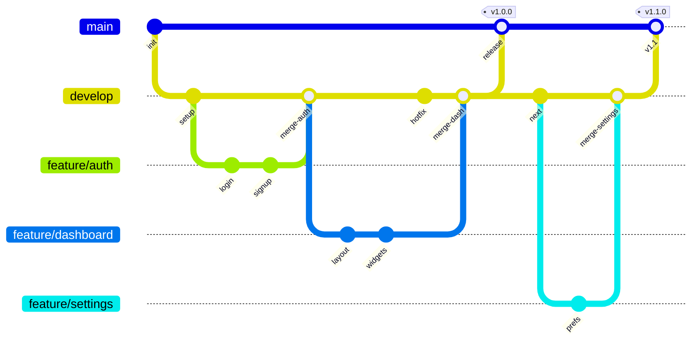

## 10. C4 Context Diagram -- SaaS Application

**When to use:** High-level system architecture, external integrations, system boundaries.

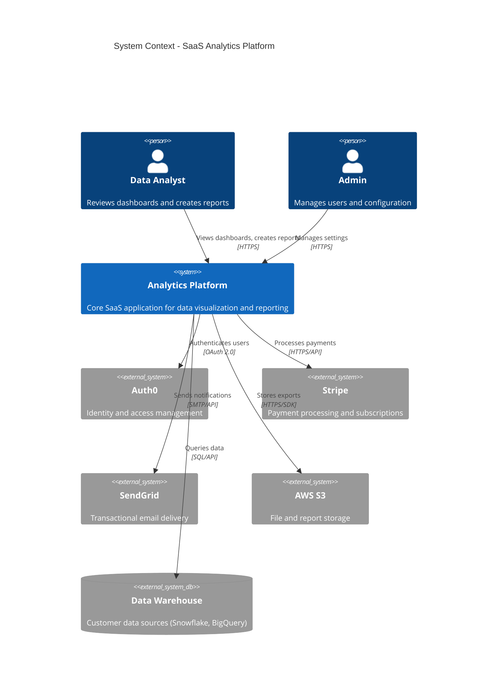

## 11. Architecture Diagram -- Clean Microservices Architecture

**When to use:** System-level architecture with multiple services, layered grouping, and color-coded components. Demonstrates subgraph organization, edge labeling, and legend inclusion.

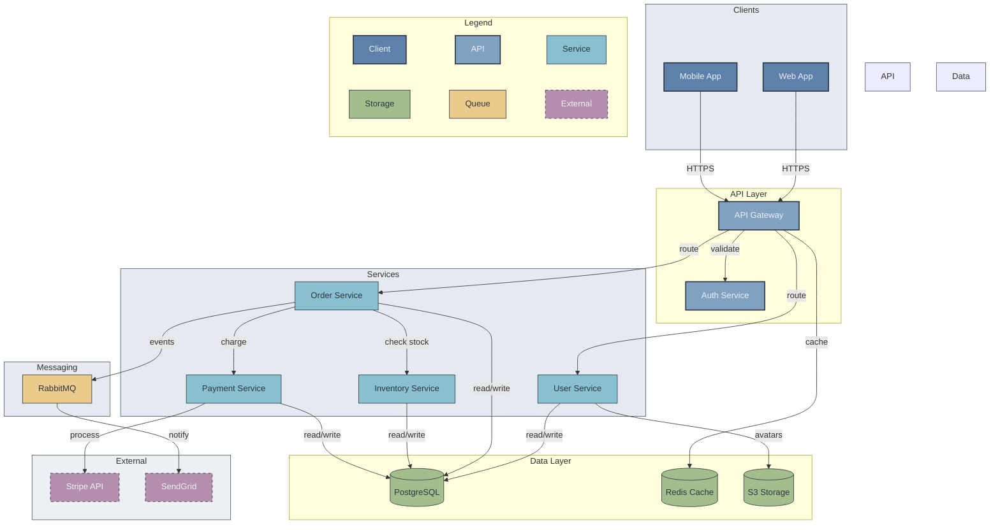

**Techniques demonstrated:**
- 16 nodes organized into 6 subgraphs (3-4 nodes each)
- Color-coded components with `classDef` classes
- Edges defined outside subgraphs for optimal layout
- Short edge labels (1-2 words)
- Legend subgraph for color reference
- Alternating subgraph fill colors for layer distinction

## 12. Anti-Pattern vs Clean Pattern -- Same System, Two Approaches

**When to use:** Reference this example to understand what makes architecture diagrams cluttered and how to fix them. Shows the same e-commerce system drawn two ways.

### Anti-Pattern: Flat, Unorganized (21 nodes, no grouping)

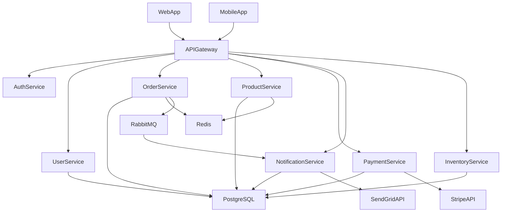

**Problems with this approach:**
- 21 nodes with no subgraph grouping -- flat layout with many edge crossings
- No color coding -- all nodes look identical, hard to distinguish component types
- No edge labels -- relationships are ambiguous (what does the arrow mean?)
- Every service connects directly to PostgreSQL -- 5 crossing edges to one node
- No visual hierarchy -- clients, services, and databases all at the same level

### Clean Pattern: Organized, Color-Coded (14 nodes, grouped)

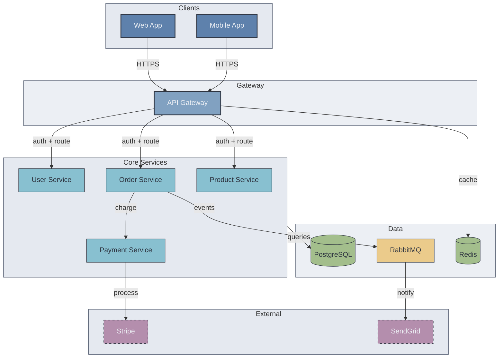

**What changed and why:**
- **Reduced from 21 to 14 nodes** -- Merged NotificationService and InventoryService into core services (they are implementation details at this zoom level)
- **Grouped into 5 subgraphs** -- Clear layers: Clients, Gateway, Core Services, Data, External
- **Color-coded by type** -- Instantly distinguishable: blue clients, teal services, green storage, purple external
- **Labeled edges** -- Every arrow tells you what the connection does
- **Eliminated redundant DB connections** -- One `Core Services --> PG` edge replaces 5 individual connections
- **Subgraph styling** -- Light alternating backgrounds separate layers visually

## 13. Component Decomposition -- Overview + Detail Diagrams

**When to use:** Systems where one or more blocks have significant internal complexity. Instead of cramming everything into one diagram, show a collapsed overview and separate detail diagrams for each complex block.

### Overview Diagram (System Level)

The Order Service and Payment Service are complex internally, so they appear as single `«detail»` nodes here. The overview stays clean at 12 nodes.

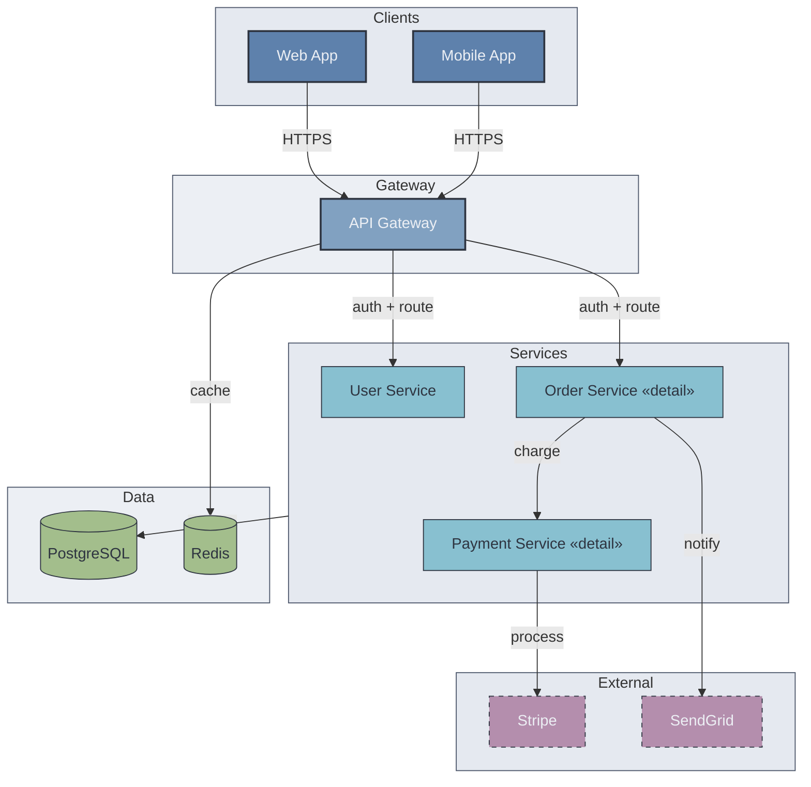

### Detail Diagram: Order Service Internals

This expands the `Order Service «detail»` node from the overview. Uses the same teal `service` color to maintain visual continuity.

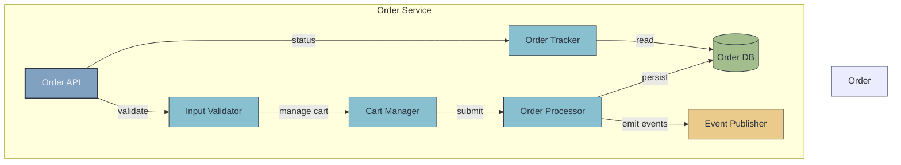

### Detail Diagram: Payment Service Internals

This expands the `Payment Service «detail»` node from the overview.

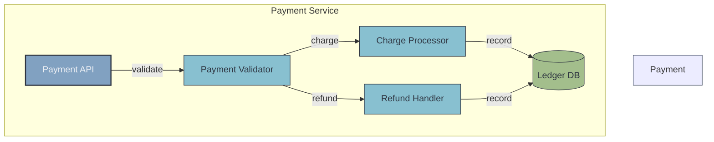

**Techniques demonstrated:**
- Overview stays at 12 nodes by collapsing complex services to single `«detail»` nodes
- Each detail diagram is self-contained with 5-7 nodes
- Same `classDef` colors used across all diagrams for visual continuity
- `«detail»` label signals to readers that a drill-down exists
- Readers get the full system picture (overview) and can dive into any block (detail)

## Usage Tips

- **Start simple** - Begin with the most basic version, then add detail
- **One diagram per concern** - Don't combine class and sequence in one diagram
- **Label edges** - Unlabeled arrows are ambiguous; always add relationship labels
- **Use subgraphs/groups** - Group related nodes to reduce visual clutter
- **Mind the node count** - Refer to type-specific limits in `output-formatting.md`
- **Test rendering** - Preview in your target platform before finalizing
- **Always use the clean pattern for architecture** - See Example 12; never create flat architecture diagrams
- **Color code all architecture diagrams** - Use the standard palette from `output-formatting.md` when there are 3+ component types
- **Include legends** - Add a legend subgraph to every color-coded diagram
- **Decompose complex blocks** - Use the overview + detail pattern (Example 13) instead of cramming internal details into the main diagram
