# Mermaid Syntax: Core Diagram Types

Syntax reference for the four most commonly used Mermaid diagram types: flowchart, sequence, class, and ER.

## Flowchart

### Basic Structure

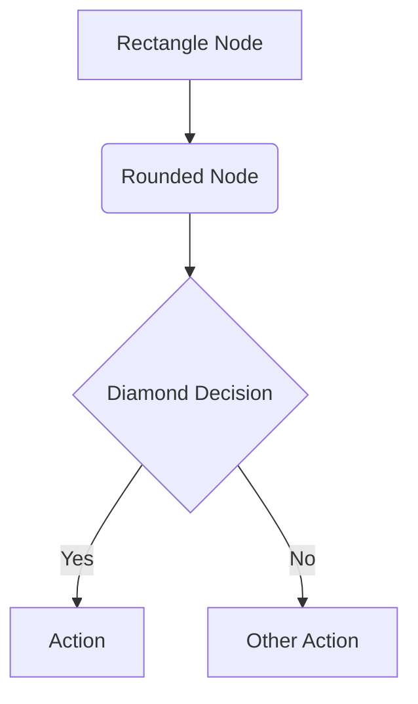

### Direction

- `graph TD` or `graph TB` - Top to bottom
- `graph BT` - Bottom to top
- `graph LR` - Left to right
- `graph RL` - Right to left

### Node Shapes

```
A[Rectangle]
B(Rounded rectangle)
C([Stadium])
D[[Subroutine]]
E[(Database/Cylinder)]
F((Circle))
G>Asymmetric/Flag]
H{Diamond/Decision}
I{{Hexagon}}
J[/Parallelogram/]
K[\Reverse parallelogram\]
L[/Trapezoid\]
M[\Reverse trapezoid/]
```

### Link Types

```
A --> B          Solid arrow
A --- B          Solid line (no arrow)
A -.-> B         Dotted arrow
A -.- B          Dotted line
A ==> B          Thick arrow
A === B          Thick line
A --text--> B    Arrow with text
A ---|text| B    Line with text
A ~~~B           Invisible link (for layout)
```

### Subgraphs

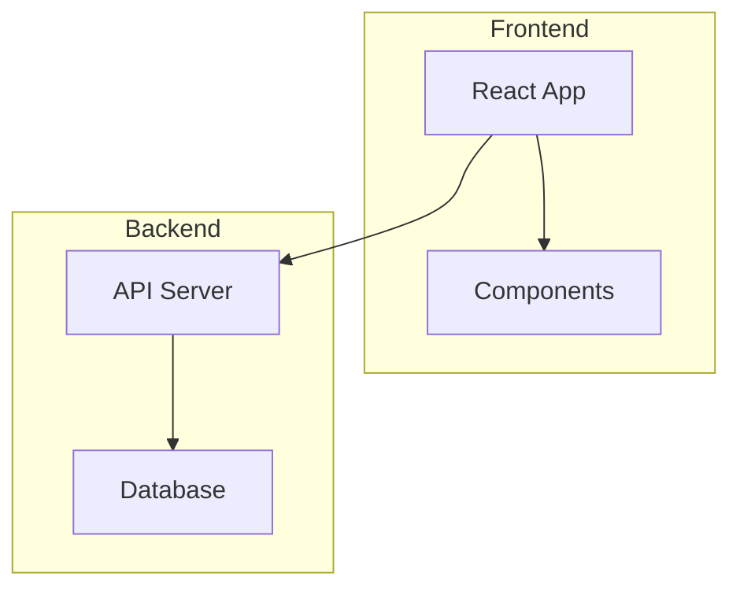

Subgraphs can be nested:

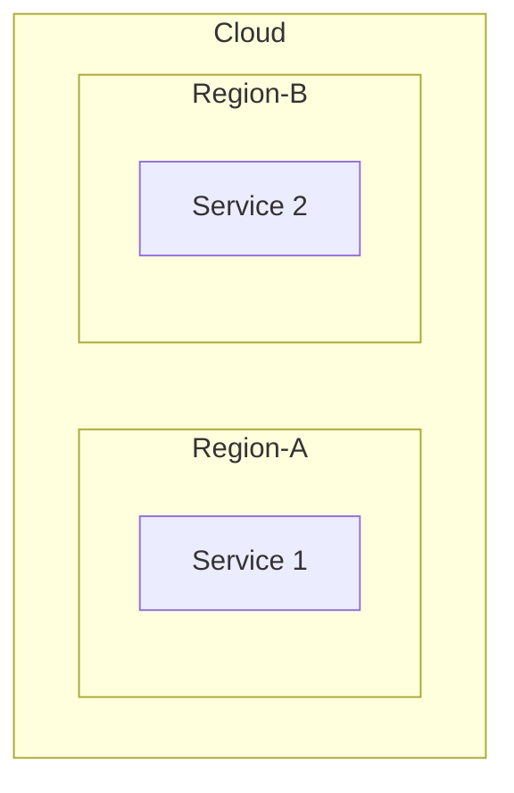

### Styling

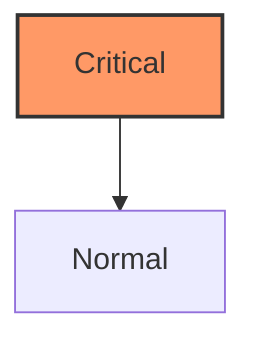

Apply styles directly:

```
style A fill:#f9f,stroke:#333,stroke-width:4px
```

## Sequence Diagram

### Basic Structure

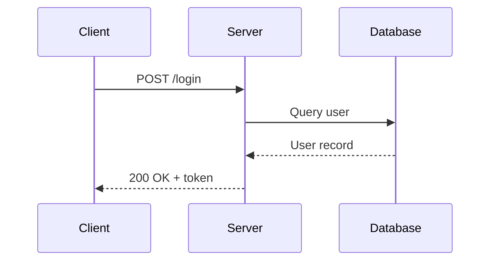

### Participants and Actors

```
participant A as Alice        Box participant
actor B as Bob                Stick figure actor
```

Participants render in declaration order (left to right).

### Message Types

```
A->>B    Solid line with arrowhead
A-->>B   Dotted line with arrowhead
A-xB     Solid line with cross (async, lost message)
A--xB    Dotted line with cross
A-)B     Solid line with open arrow (async)
A--)B    Dotted line with open arrow
```

### Activation (Lifelines)

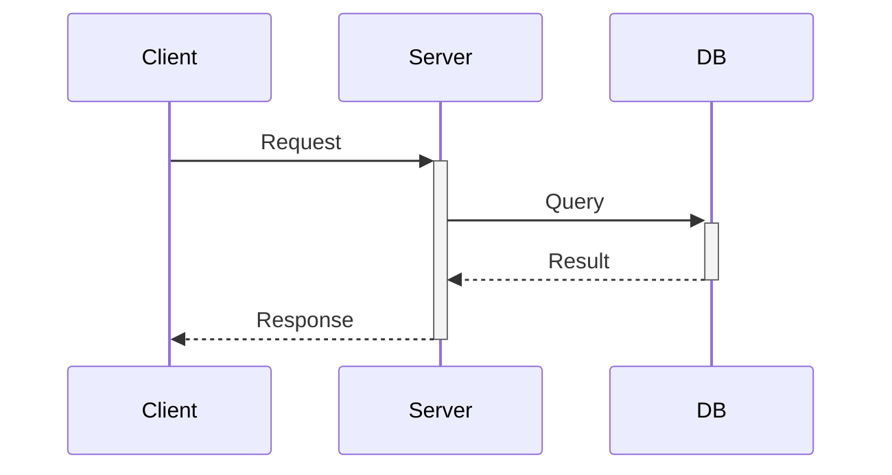

Use `+` to activate, `-` to deactivate. Or use explicit blocks:

```
activate Server
deactivate Server
```

### Loops, Alternatives, and Grouping

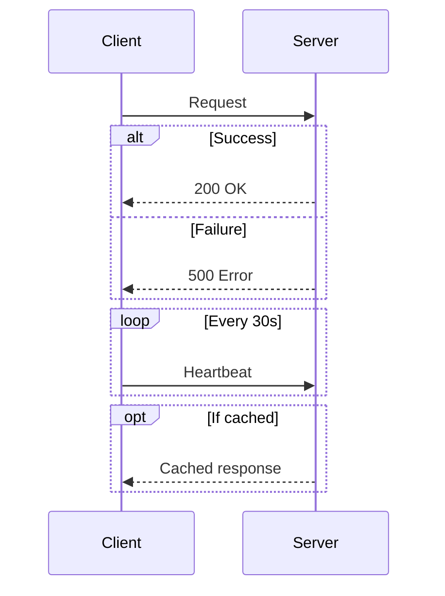

### Notes

```
Note right of A: Single participant note
Note over A,B: Spanning note
Note left of B: Left side note
```

### Participant Boxes

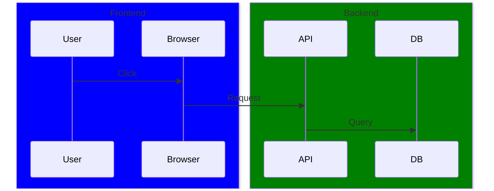

### Sequence Numbers

Add `autonumber` after the opening line to auto-number messages:

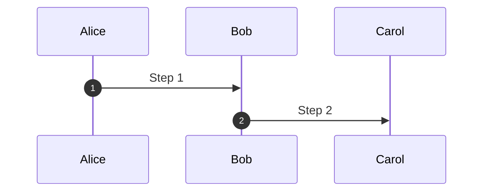

## Class Diagram

### Basic Structure

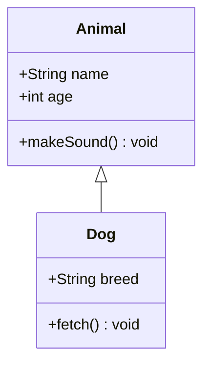

### Visibility Modifiers

```
+ Public
- Private
# Protected
~ Package/Internal
```

### Members and Methods

```
class BankAccount {
    +String owner
    +BigDecimal balance
    +deposit(amount) bool
    +withdraw(amount) bool
    -validateAmount(amount) bool
}
```

Abstract and static:

```
class Shape {
    +draw()* void          Abstract method (asterisk)
    +getCount()$ int       Static method (dollar sign)
}
```

### Relationships

```
A <|-- B     Inheritance (B extends A)
A *-- B      Composition (B is part of A, lifecycle dependent)
A o-- B      Aggregation (B is part of A, independent lifecycle)
A --> B      Association (A uses B)
A ..> B      Dependency (A depends on B)
A ..|> B     Realization/Implementation (A implements B)
A -- B       Link (solid)
A .. B       Link (dashed)
```

### Cardinality

```
A "1" --> "*" B : has
A "1" --> "0..*" B : contains
A "0..1" --> "1..*" B : manages
```

### Annotations

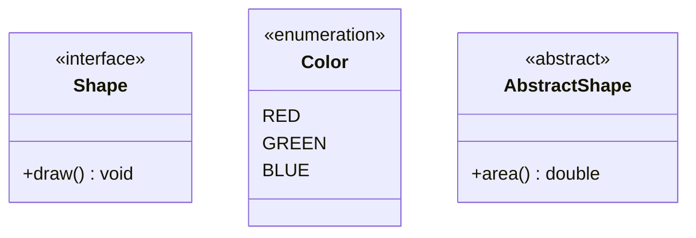

### Namespaces

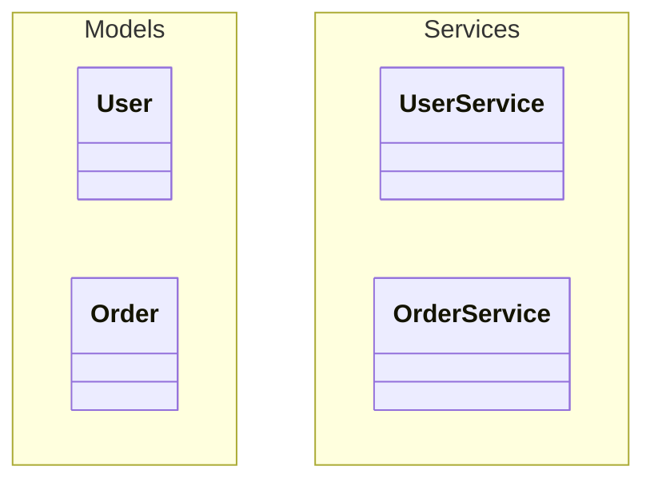

## Entity Relationship (ER) Diagram

### Basic Structure

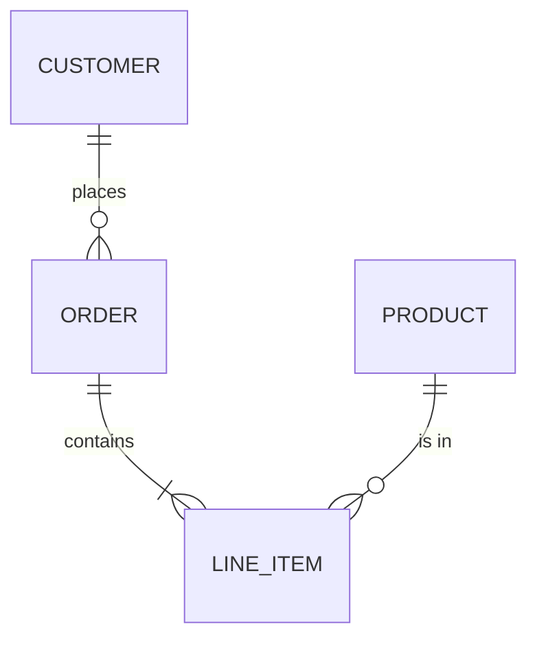

### Relationship Types

Left side and right side markers:

```
||    Exactly one
o|    Zero or one
}|    One or more
}o    Zero or more
```

Combine left and right with a line:

```
||--||    One to one
||--o{    One to zero-or-more
||--|{    One to one-or-more
o|--o{    Zero-or-one to zero-or-more
```

### Relationship Labels

```
CUSTOMER ||--o{ ORDER : places
ORDER ||--|{ LINE_ITEM : contains
```

The label after `:` describes the relationship. Use quotes for multi-word labels:

```
PRODUCT ||--o{ LINE_ITEM : "is ordered in"
```

### Entity Attributes

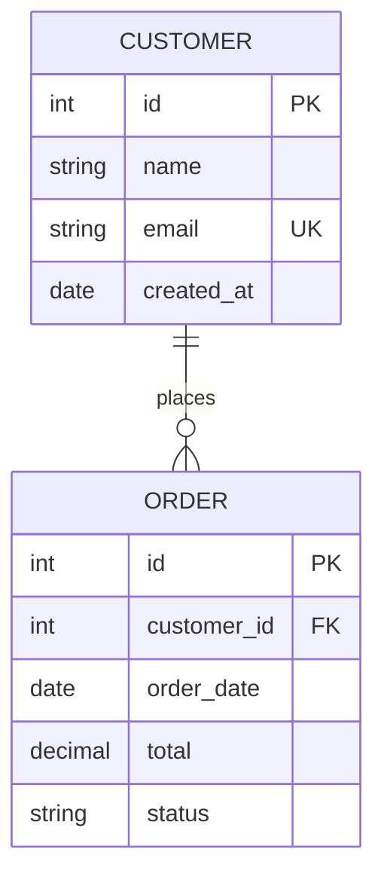

### Attribute Annotations

```
PK    Primary Key
FK    Foreign Key
UK    Unique Key
```

### Naming Conventions

- Entity names: UPPER_CASE or PascalCase
- Attribute names: snake_case or camelCase
- Keep entity names short (they become node labels)

## General Tips

### Special Characters in Labels

Wrap labels with quotes when they contain special characters:

```
A["Node with (parens)"]
A["Node with {braces}"]
```

### Comments

```
%% This is a comment in Mermaid
```

### Escaping

Use `#quot;` for double quotes, `#amp;` for ampersand within labels.

### Node ID vs Label

Node IDs must be unique. Use separate labels for display:

```
node1["Display Label for Node 1"]
node2["Display Label for Node 2"]
node1 --> node2
```
