# Mermaid Syntax: Extended Diagram Types

Syntax reference for state, Gantt, mindmap, pie, git graph, and C4 context diagrams.

## State Diagram

### Basic Structure

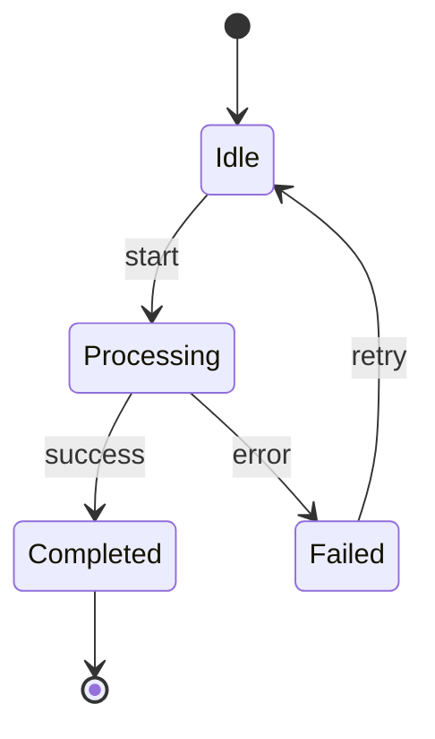

### Start and End States

```
[*] --> First       Start state
Last --> [*]         End state
```

### Transitions

```
StateA --> StateB : event/trigger
StateA --> StateB               (no label)
```

### Composite States

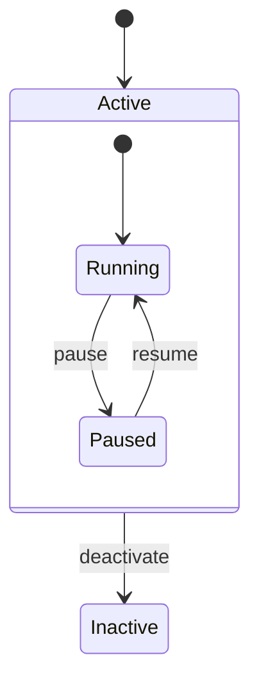

### Concurrent States (Fork/Join)

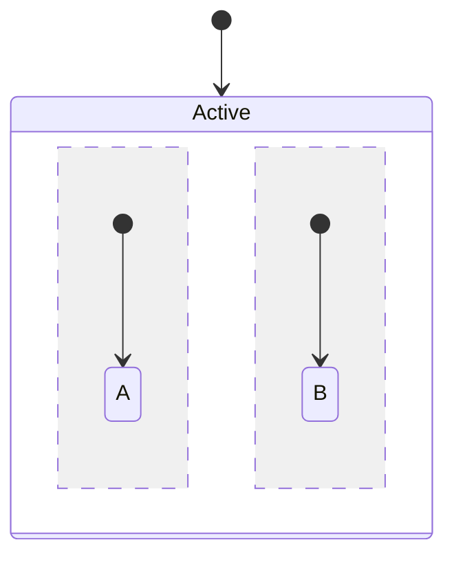

The `--` separator creates parallel regions.

### Choice Pseudostate

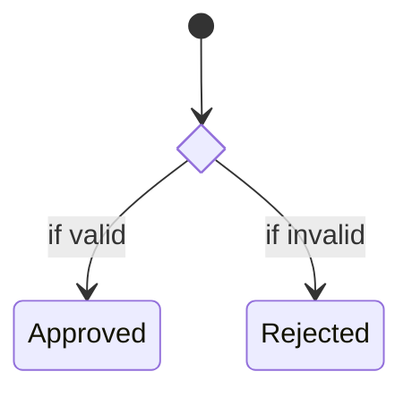

### Notes

```
note right of StateA
    This is a note about StateA
end note

note left of StateB : Short note
```

### Direction

```
stateDiagram-v2
    direction LR
    [*] --> A
    A --> B
    B --> [*]
```

## Gantt Chart

### Basic Structure

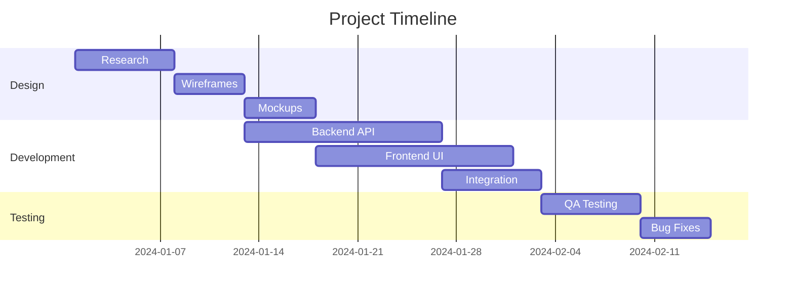

### Date Format

```
dateFormat YYYY-MM-DD       Default ISO format
dateFormat DD-MM-YYYY       European format
dateFormat X                Unix timestamp
```

### Task Syntax

```
Task name    :id, start_date, duration
Task name    :id, start_date, end_date
Task name    :id, after other_id, duration
```

### Task Modifiers

```
Active task     :active, a1, 2024-01-01, 7d
Done task       :done, a2, 2024-01-01, 7d
Critical task   :crit, a3, 2024-01-08, 5d
Milestone       :milestone, m1, 2024-01-15, 0d
```

Combine modifiers:

```
Critical active :crit, active, a1, 2024-01-01, 7d
```

### Sections

Sections group tasks visually:

```
section Phase 1
    Task A :a1, 2024-01-01, 7d

section Phase 2
    Task B :b1, after a1, 5d
```

### Excluding Dates

```
gantt
    excludes weekends
    excludes 2024-12-25
```

### Axis Format

```
axisFormat %Y-%m-%d
axisFormat %m/%d
axisFormat %b %d
```

## Mindmap

### Basic Structure

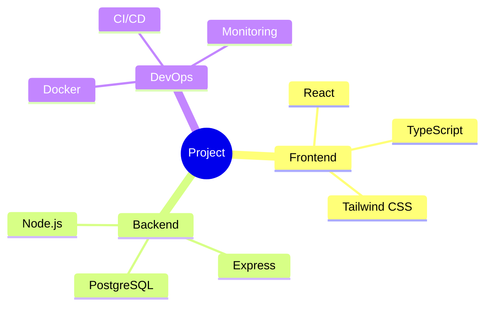

### Node Shapes

```
root                Default (rectangle)
root((Circle))      Circle shape
root)Cloud(         Cloud shape
root[Square]        Square shape
root(Rounded)       Rounded shape
root{{Hexagon}}     Hexagon shape
```

### Hierarchy

Indentation defines the hierarchy. Each level is indented further:

```
mindmap
    Level 0
        Level 1a
            Level 2a
            Level 2b
        Level 1b
            Level 2c
```

### Icons (Font Awesome)

```
mindmap
    root
        A
        ::icon(fa fa-book)
        B
```

## Pie Chart

### Basic Structure

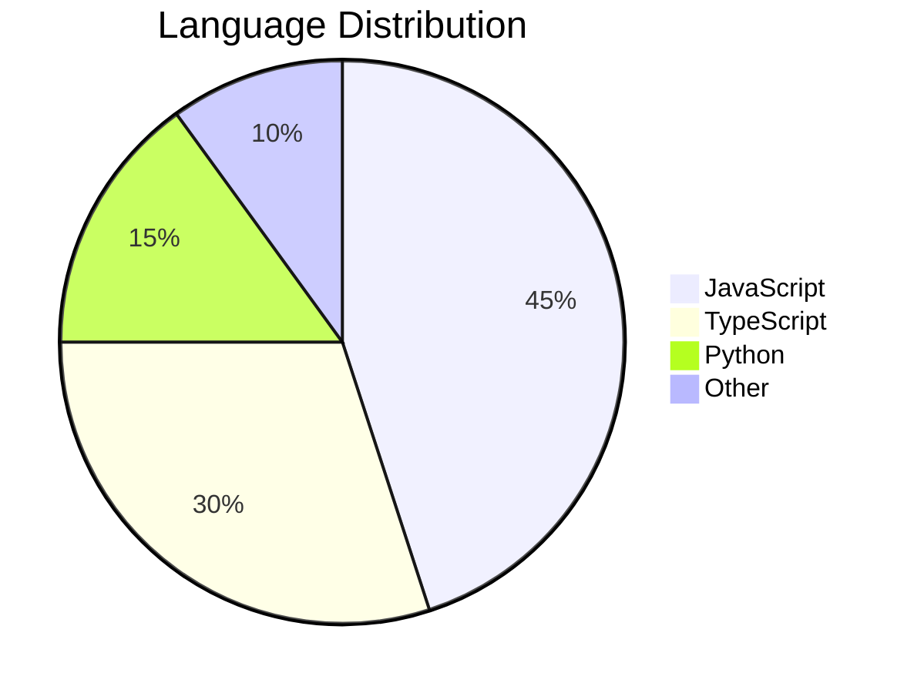

### Options

```
pie showData        Show raw values next to the percentages
    "A" : 50
    "B" : 30
    "C" : 20
```

Values are automatically converted to percentages.

## Git Graph

### Basic Structure

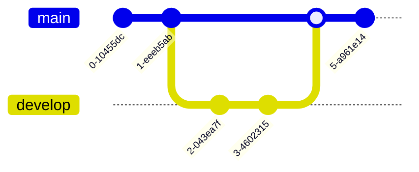

### Commands

```
commit                              Simple commit on current branch
commit id: "abc123"                 Commit with custom ID
commit id: "feat" tag: "v1.0"      Commit with tag
commit type: HIGHLIGHT              Highlighted commit
commit type: REVERSE                Reversed/reverted commit
branch feature-x                    Create new branch
checkout feature-x                  Switch to branch
merge feature-x                     Merge branch into current
cherry-pick id: "abc123"            Cherry-pick a commit
```

### Commit Types

```
commit type: NORMAL       Default style
commit type: HIGHLIGHT    Emphasized commit
commit type: REVERSE      Reverted/reversed commit
```

### Branch Ordering

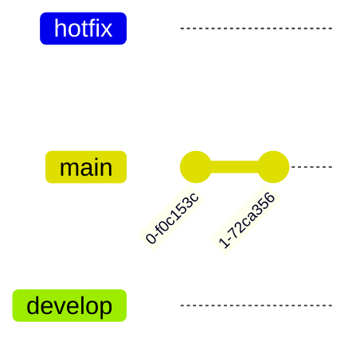

### Orientation

```
gitGraph TB:
    commit
    commit
```

## C4 Context Diagram

### Basic Structure

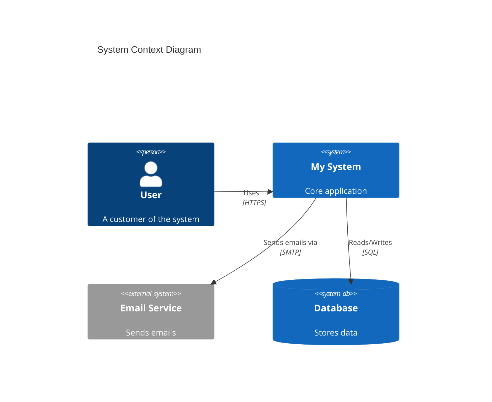

### Elements

```
Person(alias, "Label", "Description")
Person_Ext(alias, "Label", "Description")           External person
System(alias, "Label", "Description")
System_Ext(alias, "Label", "Description")            External system
SystemDb(alias, "Label", "Description")              Database system
SystemDb_Ext(alias, "Label", "Description")          External database
SystemQueue(alias, "Label", "Description")           Queue system
SystemQueue_Ext(alias, "Label", "Description")       External queue
```

### Boundaries

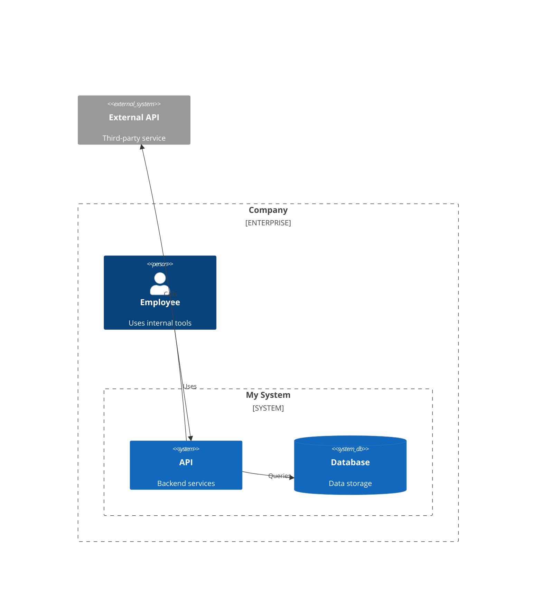

### Relationships

```
Rel(from, to, "label")
Rel(from, to, "label", "technology")
BiRel(a, b, "label")                      Bidirectional
Rel_U(from, to, "label")                  Upward
Rel_D(from, to, "label")                  Downward
Rel_L(from, to, "label")                  Leftward
Rel_R(from, to, "label")                  Rightward
```

### Layout Tags

```
UpdateLayoutConfig($c4ShapeInRow="3", $c4BoundaryInRow="1")
UpdateRelStyle(from, to, $offsetY="-40", $offsetX="10")
```

## General Configuration

### Init Directive

Apply configuration to any diagram type:

```
%%{init: {'theme': 'forest'}}%%
graph TD
    A --> B
```

### Available Themes

```
default
forest
dark
neutral
base
```

### Font Size and Styling

```
%%{init: {'theme': 'default', 'themeVariables': {'fontSize': '16px'}}}%%
```
