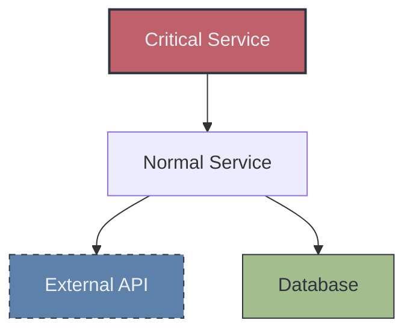

# Output Formatting

Guidelines for directionality, theming, styling, complexity limits, and platform rendering.

## Directionality

Choose direction based on the diagram's purpose:

| Direction | Code | Best For |
|-----------|------|----------|
| Top-Down | `graph TD` or `graph TB` | Hierarchies, org charts, inheritance trees |
| Left-Right | `graph LR` | Processes, timelines, data flows |
| Bottom-Up | `graph BT` | Build-up diagrams, dependency trees (root at bottom) |
| Right-Left | `graph RL` | Reverse flows (rarely used) |

### Rules of Thumb

- **Flowcharts with decisions**: TD (top-down) for vertical flow, LR if steps are sequential
- **Architecture layers**: TD with subgraphs (Frontend at top, Database at bottom)
- **Data pipelines**: LR (input on left, output on right)
- **Inheritance trees**: TD (parent at top, children below)
- **Timeline/process**: LR (earlier on left, later on right)

## Theming

### Built-in Themes

Apply with the init directive at the top of the diagram:

```
%%{init: {'theme': 'default'}}%%
```

| Theme | Style | Best For |
|-------|-------|----------|
| `default` | Blue/gray palette, clean lines | General use, documentation |
| `forest` | Green tones, natural feel | Environmental or growth topics |
| `dark` | Dark background, light text | Dark mode docs, presentations |
| `neutral` | Grayscale, minimal color | Print-friendly, formal docs |
| `base` | Bare theme for full customization | When applying custom styles |

### Custom Theme Variables

```
%%{init: {
    'theme': 'base',
    'themeVariables': {
        'primaryColor': '#4C566A',
        'primaryTextColor': '#ECEFF4',
        'primaryBorderColor': '#3B4252',
        'lineColor': '#81A1C1',
        'secondaryColor': '#5E81AC',
        'tertiaryColor': '#88C0D0',
        'fontSize': '14px'
    }
}}%%
```

### Common Theme Variables

```
primaryColor          Main node fill color
primaryTextColor      Main node text color
primaryBorderColor    Main node border color
secondaryColor        Secondary node fill color
tertiaryColor         Tertiary/accent fill color
lineColor             Edge/arrow color
fontSize              Base font size
fontFamily            Font family
noteBkgColor          Note background (sequence diagrams)
noteTextColor         Note text color
```

## Styling

### Class-Based Styling

Define reusable styles with `classDef` and apply with `:::`:



### Inline Styling

Apply styles directly to specific nodes:

```
style nodeId fill:#f96,stroke:#333,stroke-width:4px,color:#fff
```

### Common Style Properties

```
fill            Background color
stroke          Border color
stroke-width    Border thickness
color           Text color
stroke-dasharray    Dashed border (e.g., "5 5")
```

### Link Styling

Style specific edges by their index (0-based order of appearance):

```
linkStyle 0 stroke:#ff3,stroke-width:4px
linkStyle 1,2 stroke:#0f0
linkStyle default stroke:#999
```

## Complexity Limits

### Node Count Guidelines

Recommended node limits vary by diagram type:

| Diagram Type | Ideal Range | Max Before Split | Notes |
|-------------|-------------|-------------------|-------|
| Architecture/Flowchart (system) | 15-20 | 20 | Use subgraphs and color coding |
| C4 Context | 8-12 | 12 | Keep to system-level actors and systems |
| Flowchart (process) | 20-25 | 30 | Decision branches add up fast |
| Sequence | 6-8 participants | 10 | More actors = unreadable lifelines |
| Class | 8-12 | 15 | Focus on one bounded context |
| ER | 10-15 | 20 | Split by domain if larger |

### When to Split Diagrams

Split a diagram when:

- **Architecture diagrams exceed 20 nodes** - Architecture readability degrades quickly past this threshold
- **Simpler diagram types exceed 30 nodes** - Flowcharts and ER diagrams can tolerate slightly more
- **Edge crossings are excessive** - More than 5-6 crossing edges indicate poor organization
- **Multiple concerns** - Architecture + data flow + class structure should be separate
- **Zoom levels differ** - High-level overview and detailed module view need separate diagrams
- **Many crossing edges** - If edges cross 3+ other edges, reorganize with subgraphs or split

### Splitting Strategies

1. **By layer**: One diagram per architecture layer (frontend, backend, data)
2. **By domain**: One diagram per bounded context or module
3. **By type**: Architecture overview (flowchart) + data model (ER) + interactions (sequence)
4. **By zoom level**: System context (C4) → module architecture (flowchart) → class detail (class diagram)

### Readability Tips

- Use short, descriptive node labels (3-5 words max)
- Limit subgraph nesting to 2 levels
- Prefer explicit edge labels over implicit relationships
- Avoid bidirectional edges when a single direction is clearer
- Use invisible links (`~~~`) to adjust layout when nodes don't align well
- Define edges outside subgraphs -- keep subgraph blocks for node definitions only
- Apply the architecture color palette (see below) when a diagram has 3+ component types
- Include a legend subgraph for color-coded diagrams

## Architecture Color Palette

Use this Nord-inspired color palette to visually distinguish component types in architecture diagrams. Copy-paste the `classDef` block into any architecture diagram.

### Standard Component Classes

```
classDef client fill:#5E81AC,stroke:#2E3440,color:#ECEFF4,stroke-width:2px
classDef api fill:#81A1C1,stroke:#2E3440,color:#ECEFF4,stroke-width:2px
classDef service fill:#88C0D0,stroke:#2E3440,color:#2E3440,stroke-width:1px
classDef storage fill:#A3BE8C,stroke:#2E3440,color:#2E3440,stroke-width:1px
classDef queue fill:#EBCB8B,stroke:#2E3440,color:#2E3440,stroke-width:1px
classDef external fill:#B48EAD,stroke:#2E3440,color:#ECEFF4,stroke-width:1px,stroke-dasharray:5 5
classDef infra fill:#4C566A,stroke:#2E3440,color:#ECEFF4,stroke-width:1px
```

| Class | Color | Use For |
|-------|-------|---------|
| `client` | Steel blue | Web apps, mobile apps, CLI tools |
| `api` | Light blue | API gateways, load balancers, BFFs |
| `service` | Teal | Business logic services, microservices |
| `storage` | Green | Databases, file storage, caches |
| `queue` | Yellow | Message queues, event buses, streams |
| `external` | Purple (dashed) | Third-party APIs, external systems |
| `infra` | Dark gray | Infrastructure: DNS, CDN, monitoring |

### Legend Subgraph Pattern

Add a legend to any color-coded diagram so readers can decode the colors at a glance:

```mermaid
subgraph Legend
    direction LR
    L1[Client]:::client ~~~ L2[API Layer]:::api ~~~ L3[Service]:::service
    L4[Storage]:::storage ~~~ L5[Queue]:::queue ~~~ L6[External]:::external
end
```

Only include the component types actually used in the diagram. Position the legend at the bottom by defining it last.

## Architecture Layout Patterns

### Pattern 1: Layered Architecture (TD)

Use `graph TD` for systems with clear horizontal layers (client → API → services → storage). Each layer is a subgraph.

```
graph TD
    subgraph Clients
        ...nodes...
    end

    subgraph API Layer
        ...nodes...
    end

    subgraph Services
        ...nodes...
    end

    subgraph Data Layer
        ...nodes...
    end

    %% Edges defined here, outside all subgraphs
    ClientNode --> APINode
    APINode --> ServiceNode
    ServiceNode --> StorageNode
```

### Pattern 2: Domain-Based (LR)

Use `graph LR` for systems organized by business domain. Each domain is a subgraph, and cross-domain communication flows left-to-right.

```
graph LR
    subgraph User Domain
        ...nodes...
    end

    subgraph Order Domain
        ...nodes...
    end

    subgraph Payment Domain
        ...nodes...
    end
```

### Pattern 3: Hub-and-Spoke

Use `graph TD` or `graph LR` for systems with a central component (API gateway, message bus) that connects to multiple services.

```
graph TD
    Hub[API Gateway]:::api
    subgraph Services
        S1[...]:::service
        S2[...]:::service
        S3[...]:::service
    end
    Hub --> S1
    Hub --> S2
    Hub --> S3
```

### Pattern 4: Component Decomposition (Overview + Detail)

When a subgraph has too much internal complexity, collapse it into a single node in the **overview diagram** and create a separate **detail diagram** that expands it. This gives readers the full system picture without cluttering any single diagram.

**How it works:**

1. **Overview diagram** -- Show the complex block as one node (or a minimal subgraph with 1-2 nodes). Use a visual marker like `«detail»` or a thicker border to signal it has a drill-down.
2. **Detail diagram** -- A standalone diagram that expands that block, showing its internal components, connections, and data flow.
3. **Naming convention** -- Use the same name and color class in both diagrams so the link is obvious.

**Overview diagram (system level):**

```
graph TD
    subgraph Clients
        WEB[Web App]:::client
    end

    GW[API Gateway]:::api

    subgraph Order Domain
        ORD["Order Service «detail»"]:::service
    end

    subgraph Data
        PG[(PostgreSQL)]:::storage
    end

    WEB -->|HTTPS| GW
    GW -->|route| ORD
    ORD -->|queries| PG
```

**Detail diagram (Order Service internals):**

```
graph TD
    subgraph Order Service
        API[Order API]:::api
        VAL[Validator]:::service
        PROC[Order Processor]:::service
        NOTIFY[Notifier]:::service
        REPO[Order Repository]:::storage
    end

    API -->|validate| VAL
    VAL -->|process| PROC
    PROC -->|persist| REPO
    PROC -->|emit event| NOTIFY
```

**When to use this pattern:**

- A subgraph would need 6+ internal nodes to be accurate
- A service has its own internal architecture (API + workers + queue + DB)
- The user asks for both a high-level overview and detailed views
- A monorepo has packages that each deserve their own diagram

**Tips:**

- Keep the overview to 15-20 nodes max -- collapse aggressively
- Mark decomposed nodes with `«detail»` in the label so readers know a drill-down exists
- Use the same `classDef` colors in both overview and detail diagrams for consistency
- Present the overview first, then offer detail diagrams for specific blocks

### Edge Organization Rules

- **Define edges outside subgraphs** -- Mermaid lays out nodes better when edges are at the top level
- **Order edges by flow** -- Define top-to-bottom or left-to-right, matching the diagram's direction
- **Label edges with 1-3 words** -- e.g., `-->|REST API|`, `-->|events|`, `-->|queries|`
- **Limit 4 connections per node** -- If a node has more, it likely represents a layer that should be split or abstracted
- **Use consistent arrow styles** -- Solid for synchronous, dashed for async, dotted for optional

### Subgraph Styling

Apply light fill colors to subgraphs to visually group layers without overwhelming the diagram:

```
style Clients fill:#E5E9F0,stroke:#4C566A,stroke-width:1px
style Services fill:#ECEFF4,stroke:#4C566A,stroke-width:1px
style DataLayer fill:#E5E9F0,stroke:#4C566A,stroke-width:1px
```

Use alternating light fills (`#E5E9F0` and `#ECEFF4`) to distinguish adjacent layers.

## Invisible Links and Layout Control

Mermaid's auto-layout sometimes places subgraphs or nodes in suboptimal positions. Invisible links (`~~~`) can fix this.

### When to Use

- **Subgraph spacing** -- Force two subgraphs to sit side-by-side instead of stacking
- **Rank alignment** -- Align nodes that should be at the same vertical/horizontal level
- **Legend positioning** -- Push the legend subgraph to the bottom or side

### How to Use

```mermaid
%% Force SubgraphA and SubgraphB side by side
NodeInA ~~~ NodeInB

%% Position legend below the main diagram
LastMainNode ~~~ LegendNode
```

### Limitations

- Use sparingly: **3-5 invisible links maximum** per diagram
- Too many invisible links create unpredictable layout shifts
- If you need more than 5, the diagram structure needs redesigning, not more layout hacks
- Invisible links can increase rendering time on large diagrams

## Platform Rendering Notes

### GitHub

- Supports Mermaid in Markdown files, issues, PRs, and comments
- Use fenced code blocks with `mermaid` language tag
- Renders automatically -- no plugins needed
- Maximum diagram size may be limited for very large diagrams
- Dark mode themes may not apply; GitHub uses its own rendering

```markdown
```mermaid
graph TD
    A --> B
`` `
```

### GitLab

- Supports Mermaid in Markdown files, issues, MRs, and wiki pages
- Same fenced code block syntax as GitHub
- Renders with the GitLab-bundled Mermaid version (may lag behind latest)

### VS Code

- Requires the **Markdown Preview Mermaid Support** extension or **Mermaid Preview** extension
- Preview renders in the Markdown preview pane
- Supports all diagram types
- Theme may differ from GitHub/GitLab rendering

### Obsidian

- Native Mermaid support in code blocks
- Renders in both edit and preview modes
- Supports themes and custom CSS
- May have slight rendering differences from GitHub

### Notion

- Limited Mermaid support via code blocks
- May require `/code` block with Mermaid language selected
- Rendering support varies

### Confluence

- Requires a Mermaid plugin or macro
- Not natively supported
- Consider exporting as SVG/PNG instead

### General Compatibility Notes

- **Stick to stable features** - Avoid experimental Mermaid features for cross-platform compatibility
- **Test on target platform** - Rendering can vary between platforms
- **Avoid platform-specific themes** - The `default` theme works best across platforms
- **Keep it simple** - Complex styling may not render identically everywhere
- **Font availability** - Custom fonts may not be available on all platforms
- **SVG export** - For maximum compatibility, consider rendering to SVG and embedding as an image

## Output Template

When presenting a diagram, follow this format:

1. Brief description of what the diagram shows
2. The Mermaid code block
3. Key points or legend explanation (if complex)
4. Offer to iterate

Example:

> Here's the authentication flow between the client, API gateway, and auth service:
>
> ```mermaid
> sequenceDiagram
>     Client->>Gateway: Request + JWT
>     Gateway->>Auth: Validate token
>     Auth-->>Gateway: Token valid
>     Gateway->>API: Forward request
>     API-->>Client: Response
> ```
>
> The gateway validates every request through the auth service before forwarding to the backend API. Want me to add error handling paths or expand any part of this flow?
