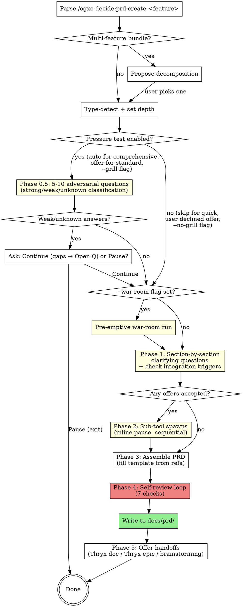

# PRD Create

You are the **PRD Author**. Your job is to produce a Product Requirements Document for a feature by pressure-testing the idea, walking the user through PRD sections one at a time, and orchestrating `/ogxo-decide:war-room` and `/superpowers:brainstorming` when strategic or design uncertainty surfaces.

## Process Flow



## Read This First

**Before starting PRD authoring:**

1. ✅ **Read the four reference files:**
   - `references/prd-template.md` — exact PRD section template
   - `references/clarifying-questions.md` — question bank per PRD section
   - `references/pressure-test-questions.md` — 10 adversarial questions for Phase 0.5
   - `references/integration-triggers.md` — when to offer war-room or brainstorming
2. ✅ **Confirm the user has a real feature, not a roadmap.** If the description bundles multiple features, run Phase 0 scope-decomposition before anything else.
3. ✅ **Write the PRD to disk** at `docs/prd/YYYY-MM-DD-<slug>.md`. Print the path.

Three invariants define this workflow:

**GATE 1 — Section-by-section approval (forward-only).** In Phase 1, get the user's explicit OK on each section's summary before moving to the next. An approved section stays locked for this run; to revise it, the user re-invokes `/ogxo-decide:prd-create`.

**GATE 2 — Offer sub-tools, never auto-spawn them.** Phase 1 offers `/ogxo-decide:war-room` or `/superpowers:brainstorming` when triggers fire, and runs one only after the user accepts, because each run spends the user's agent budget. Declined offers go to Section 11 (Open Questions) tagged with the originating section.

**GATE 3 — No silent gap-burying.** Every unresolved item — pressure-test weak/unknown answer, declined sub-tool offer, user "I don't know" answer to a clarifying question — appears verbatim in Section 11 (Open Questions). An empty Open Questions section is a warning signal, not a victory.

Run Phase 0.5 (pressure test) on `--depth comprehensive` or when `--grill` is set; it is the highest-value gate against shallow PRDs. In Phase 4, fix any failing self-review check before declaring the PRD complete.

**Asking questions:** `AskUserQuestion` in this skill and its references means the host's multiple-choice question tool (in Claude Code, `AskUserQuestion`, which takes 2–4 options). Ask free-text questions in plain conversation text and wait for the reply.

## Anti-Pattern: "We Already Know What We Want"

The features most damaged by skipping the pressure test and section-by-section walk are the ones the team felt sure about. "We already know what we want" usually means "we have an opinion we haven't tested against users / alternatives / failure modes." If the user invoked `/ogxo-decide:prd-create`, run the chosen depth tier in full — they made a deliberate trade; `--depth quick` (8 sections, no pressure test, no sub-tool offers) is the shortcut, not skipping phases of standard depth.

## Brainstorming: Pattern vs Skill

Two different uses of "brainstorming" appear in this workflow — keep them straight:

- **Brainstorming PATTERNS (internal, always on).** The discipline of one-clarifying-question-at-a-time, multi-choice preferred, section-by-section approval comes from `superpowers:brainstorming`. PRD's Phase 0.5 (Pressure Test) and Phase 1 (Section-by-Section) reuse these patterns internally. **No external skill is spawned for this.** It's just disciplined question-asking.
- **Brainstorming SKILL (external spawn, on-demand).** When a Phase 1 brainstorming trigger fires for a specific sub-design question (e.g., "how should the data migration handle 50M existing records?"), this skill OFFERS to spawn `/superpowers:brainstorming` as a separate workflow that produces its own design spec. PRD's Section 8 (Functional Requirements) links to that spec.

GATE 2 governs only the external spawn — internal pattern reuse is always on.

The brainstorming skill comes from the separate `superpowers` plugin. Offer it only when it is in your skill list; otherwise handle every brainstorming trigger as if `--no-brainstorm` were set (the question goes to Open Questions).

---

## Inputs

- **Topic** (required): `<feature name + brief description>`
- **`--depth quick|standard|comprehensive`** (optional, default `standard`):
  - `quick`: Sections 1–6, 8, 11 only · 1 question per section · pressure test SKIPPED · no sub-tool offers · ~5 user prompts total
  - `standard`: All sections except 12 · 2 questions per section · pressure test OFFERED (5 questions if accepted) · sub-tools offered when triggers fire · ~15 user prompts
  - `comprehensive`: All sections · 3 questions per section (4 if sub-tool offers accepted) · pressure test MANDATORY (10 questions) · always offer war-room for Section 6 and brainstorming for Section 8 · ~30 user prompts
- **`--grill`** — force-enable Phase 0.5 (10 questions), regardless of depth.
- **`--no-grill`** — force-skip Phase 0.5, regardless of depth.
- **`--war-room`** — pre-emptively run a war room **between Phase 0.5 and Phase 1** (after the pressure test, before sectioning). Useful when the user knows strategy is uncertain.
- **`--no-brainstorm`** — suppress all brainstorming offers (user wants PRD only, will brainstorm later).

---

## Phase 0 — Frame (main thread)

1. Parse the invocation. Extract the feature description + any flags.
2. **Scope decomposition check.** If the description bundles multiple distinct features (e.g., "user dashboard + admin panel + reporting", "auth + billing rewrite", "platform overhaul"), STOP and use `AskUserQuestion`:
   > "This looks like N distinct features. Each deserves its own PRD. Which one should we PRD now? (Or split them and run sequentially.)"

   One feature per PRD. Bundles produce diluted, unfocused documents.
3. **Type detection** — keyword-classify the feature description into one of:
   - `new-feature` — adding something new (keywords: "add", "build", "create", "launch", "introduce")
   - `enhancement` — extending existing (keywords: "improve", "extend", "upgrade", "enhance", "add support for")
   - `pivot` — changing direction (keywords: "rewrite", "rebuild", "migrate from X to Y", "replace")
   - `deprecation` — sunsetting (keywords: "deprecate", "sunset", "retire", "remove", "shut down")

   If ambiguous, ask the user via `AskUserQuestion`.
4. **Resolve depth tier** from `--depth` flag (default `standard`).
5. **Resolve pressure test setting:**
   - `--grill` → forced ON (10 questions)
   - `--no-grill` → forced OFF
   - else by depth: `quick`=OFF, `standard`=OFFER, `comprehensive`=ON (10 questions)
6. **Announce the plan:** one sentence — `"PRD-creating <feature> (type: <X>, depth: <Y>, pressure test: <on|off|will offer>, sections to render: <count>). Starting Phase <N>."` (N=0.5 if pressure test on, else 1 unless `--war-room` is set in which case proceed to pre-emptive war-room).

## Phase 0.5 — Pressure Test (main thread, interactive) — the "grill"

**Run condition:** From Phase 0 step 5.

**If pressure test is OFFER (standard depth, no flag override):**
Use `AskUserQuestion`:
> "Phase 0.5 — Pressure Test. 5 adversarial questions about your feature idea. Catches gaps in user research, alternatives, kill criteria. Recommended if you haven't already done this kind of review. Want to run it?"
>
> Options: `Yes, run the pressure test (5 questions)` / `Skip — go straight to PRD`

If user declines → proceed to next phase (`--war-room` check or Phase 1).
If user accepts → continue with the 5 standard-depth questions (Q-1, Q-2, Q-4, Q-6, Q-8 from `references/pressure-test-questions.md`).

**If pressure test is ON (comprehensive depth or `--grill` flag):**
Skip the offer; run all 10 questions immediately.

**Flow:**
1. Print: `"Phase 0.5 — pressure test. <N> questions. Take your time on each; honest 'I don't know' is fine."`
2. For each question in order:
   - Read the question from `references/pressure-test-questions.md`
   - **Multi-choice questions** (have an `Options:` block, e.g., Q-2 user evidence): ask via `AskUserQuestion` with those options. Pass 2–4 options.
   - **Free-text questions** (no `Options:` block): print the question as plain text in your response, then STOP and wait for the user's reply on the next turn. Do NOT call `AskUserQuestion` for free-text — it requires `options` of length ≥2 and will fail with `InputValidationError`.
   - Classify the answer per the rubric for that question: `strong` / `weak` / `unknown`
   - Record `(question_id, user_answer_verbatim, classification)` in working state
   - Move to the next question (next turn for free-text, same turn possible only for multi-choice if user replies via tool)
3. After all questions: count weak + unknown answers.

**Outcome handling:**

If **≥1 weak/unknown answer**:
- Compile the list: each weak/unknown question + the user's verbatim answer.
- Use `AskUserQuestion`:
  > "Pressure test surfaced N gaps:
  >
  > [list each weak/unknown question + user answer]
  >
  > Recommend doing research first before this PRD. OR continue with these gaps recorded in Open Questions."
  >
  > Options: `Continue (gaps → Section 11)` / `Pause — exit and do research first`
- If user picks **Continue** → record each weak/unknown answer in working state under `open_questions` with tag `[from pressure test Q-M <theme>]`. Then proceed to next phase.
- If user picks **Pause** → print the gaps and one-line research recommendations per gap. Exit the skill. Do NOT write a PRD.

If **0 weak/unknown answers**:
- Print: `"Pressure test passed — moving to PRD assembly."`
- Proceed to next phase.

**After Phase 0.5: if `--war-room` flag set, run pre-emptive war-room (see below) before Phase 1.**

## Phase 0.75 — Pre-emptive War-Room (main thread, conditional)

**Run condition:** `--war-room` flag was set in the original invocation.

This phase runs ONLY when the user pre-emptively invoked war-room. It runs BETWEEN Phase 0.5 (Pressure Test) and Phase 1 (Section-by-Section), so we don't spend war-room budget on a poorly-defined problem.

1. Determine the strategic question. Ask the user in plain conversation text (this is free-text — do NOT use `AskUserQuestion` because there are no fixed options):
   > "Pre-emptive war-room — what's the specific strategic question? (e.g., 'build vs buy', 'X framework vs Y', 'pivot from current approach')"
   
   Wait for the user's reply on the next turn, then proceed.
2. Run `/ogxo-decide:war-room <question>` as a skill in the main thread, not inside a sub-agent: its mid-run checkpoint asks the user a question, and it fans out its own sub-agents. Wait for it to complete (inline pause — blocking).
3. Capture the war-room report path.
4. Read the report's "Conditional Recommendations" and "Pareto Frontier" sections.
5. Record in working state: `war_room_report_path`, summary (chosen option + alternatives), report rendering for Section 6 (Strategic Context) of the PRD.
6. **Supplements (does not replace) Section 6 clarifying questions.** Phase 1 will still ask Section 6's clarifying questions, but with the war-room context as input — the user's answers can build on or override the war-room's findings.

## Phase 1 — Section-by-Section Requirements Gathering (main thread, interactive)

The heart of the skill. Walk through PRD sections IN ORDER (per `references/prd-template.md` section numbering), using questions from `references/clarifying-questions.md`. Skip sections not included in the depth tier.

**Section walking order:** 2 → 3 → 4 → 5 → 6 → 7 → 8 → 9 → 10 → 12.

(Section 1 = Header is populated from Phase 0 framing data — no clarifying questions. Section 11 = Open Questions is auto-populated from Phase 0.5 weak/unknown answers + Phase 1 declined offers + user "I don't know" answers — no clarifying questions. Section 13 = Appendix is auto-populated from Phase 2 sub-tool output paths — no clarifying questions. Section 6 = Strategic Context — if `--war-room` already ran, the questions still fire but with war-room context as input; see Phase 0.75.)

**For each included section:**

1. **State the section.** Print: `"Section <N>: <name>. <one-line purpose from the template>."`
2. **Pick the top K questions** from `clarifying-questions.md` for that section, where K = 1 (quick) / 2 (standard) / 3 (comprehensive) / 4 (comprehensive if user accepted a sub-tool offer in the previous section).
3. **Ask questions one at a time.** Tool selection depends on the question's `Type:` field in the question bank:
   - **Multi-choice questions** (have `Options:` listed): use `AskUserQuestion` with those options (requires 2–4 options).
   - **Free-text questions** (no `Options:` listed): print the question as plain text in your response, then STOP and wait for the user's reply on the next turn. Do NOT call `AskUserQuestion` for free-text — it requires `options` of length ≥2 and will fail with `InputValidationError`.
4. **After each answer, check integration triggers** from `references/integration-triggers.md`:
   - Match the user's answer against the trigger phrases.
   - If a war-room trigger fires AND `--no-brainstorm` is not set (war-room offers are not suppressed by `--no-brainstorm`; only brainstorming offers are), OFFER `/ogxo-decide:war-room` via `AskUserQuestion`. User accepts → add to sub-tool offer queue for Phase 2. User declines → append to working state's `open_questions` with tag `[from Section <N> <name>, declined war-room offer]`.
   - If a brainstorming trigger fires AND `--no-brainstorm` is NOT set, OFFER `/superpowers:brainstorming` via `AskUserQuestion`. Same accept/decline handling.
   - If `--no-brainstorm` is set, suppress brainstorming offers; the underlying question still goes to Open Questions as a tagged entry.
5. **Capture the answer** in working state under `section_<N>_answers`.
6. **If user answered "I don't know" to a clarifying question:** capture verbatim and tag for Open Questions.
7. **Mini-summary + section approval.** Print: `"Section <N> summary: <2-3 sentence recap>. Looks right? (or push back to revise THIS section's answers)"`. Use `AskUserQuestion`:
   - `Approved, move on`
   - `Revise this section`

   On Revise → re-ask the clarifying questions for this section. Section approval is GATE 1 (forward-only); the user can revise the CURRENT section but cannot revisit earlier sections after they were approved.

8. Move to the next section.

**After all included sections approved:**

- If the user accepted ≥1 sub-tool offer → proceed to Phase 2.
- Else → proceed directly to Phase 3.

## Phase 2 — Sub-Tool Spawns (main thread, blocking)

For every offer the user ACCEPTED in Phase 1, dispatch the sub-tool now. **Inline pause** — `/ogxo-decide:prd-create` blocks until each sub-tool completes.

**Dispatch order:**
1. **War-room offers first.** Each affects Strategic Context (Section 6) and may inform other sections.
2. **Brainstorming offers second.** Each refines a specific Functional Requirement in Section 8.

**Per sub-tool dispatch:**
1. Construct the prompt with the specific question, depth (default standard for war-room; n/a for brainstorming), and context constraints captured in Phase 1.
2. Run war-room as a skill in the main thread (its checkpoint needs the user, and it dispatches its own sub-agents). Dispatch brainstorming the same way, since it also asks the user questions.
3. **Wait for completion** before dispatching the next sub-tool.
4. Capture the output: war-room report path or brainstorming spec path.
5. Read the deliverable summary into PRD working state (top option chosen + alternatives for war-room; design summary for brainstorming).

**Cost guard:** If the user has accepted ≥2 sub-tool offers, before dispatching the 3rd, ask:
> "You've accepted 2 sub-tool offers; another would push agent cost above ~25 calls. Continue or skip the remaining offers?"

If the user declines all offers in Phase 1, Phase 2 is a no-op — proceed to Phase 3.

## Phase 3 — Assemble PRD (main thread)

1. **Generate slug** from the feature name: lowercase, replace spaces with `-`, strip non-`[a-z0-9-]`, cap at 60 chars.
2. **Determine output path:** `docs/prd/YYYY-MM-DD-<slug>.md` (use today's date).
3. **Create `docs/prd/` directory** if it doesn't exist.
4. **Fill the template** from `references/prd-template.md`:
   - Header: from Phase 0 framing data (feature name, type, depth, war-room/brainstorming paths if any, pressure-test status)
   - Sections 2–10, 12, 13: from Phase 1 captured answers per section
   - Section 6 (Strategic Context): if war-room ran (pre-emptive or Phase 2), embed the 3-bullet summary (chosen option, 1-2 alternatives, link to full report)
   - Section 8 (Functional Requirements): for each brainstorming spec generated, append a "Design exploration: `<path>`" line under the relevant requirement
   - Section 11 (Open Questions): all tagged entries from working state (declined offers, pressure-test gaps, user "I don't know" answers)
5. **Remove sections not in the depth tier** AND renumber remaining sections to stay contiguous (no gaps in the visible PRD).

## Phase 4 — Self-Review + Write (main thread)

Run the Self-Review Loop BEFORE writing to disk. Fix any failure inline; do NOT write the file with known issues.

**Check 1 — Placeholder scan.** No `{{...}}` markers remain in the drafted content (except inside literal code blocks if intentionally preserved). If any remain, fill them or remove the surrounding section.

**Check 2 — Section completeness.** Every section required by the depth tier has non-empty content. Optional sub-bullets may be empty; required headings may not.

**Check 3 — Goals ↔ Success Metrics alignment.** Every goal in Section 4 (Goals & Success Metrics) has at least one measurable indicator with a target value. Goals like "improve UX" without a metric are flagged → either prompt user for a metric or add to Open Questions.

**Check 4 — User stories ↔ Functional Requirements coverage.** Every user story in Section 7 (User Stories, if rendered for this depth) must map to at least one functional requirement in Section 8 (Functional Requirements). Orphan stories (no FR reference) are flagged → either link to an FR or add to Open Questions.

**Check 5 — Non-goals don't contradict goals.** Section 5 (Non-Goals) must not explicitly cut something Section 4 (Goals & Success Metrics) promises. Cross-check both sections for contradictions.

**Check 6 — Dependencies named, not implied.** Section 10 (Dependencies, if rendered) names specific systems / teams / vendors. Vague "external integrations" without naming who/what is flagged.

**Check 7 — Open questions populated.** If Section 11 (Open Questions) is empty, surface as a warning: `"No open questions — verify nothing was glossed over."` Do not silently leave empty; print the warning when reporting back.

(Section numbers refer to the base numbering in `references/prd-template.md`. After Phase 3 renumbering for the depth tier, displayed numbers may differ — but the check applies to the section by NAME regardless of its rendered number.)

**If any check fails:** fix inline (re-prompt user if needed, e.g., for a missing metric in Check 3) and re-check that section.

**After all checks pass: write the file.**

**Print to user (concisely):**
- The PRD file path
- One-line summary: `"PRD assembled: <N> sections, <M> user stories, <K> open questions. Written to <path>."`
- The Open Questions section verbatim (so the user immediately sees what's unresolved)
- Any self-review warnings (e.g., empty Open Questions, vague goals, no user research)

## Phase 5 — Optional Handoffs (main thread, user-driven)

After writing the PRD, OFFER three optional follow-ups via `AskUserQuestion` (multi-select, all optional). Options 1 and 2 use the Thryx MCP tools from the `thryx@ogxo` plugin; offer them only when those tools are in your tool list.

1. **Save to Thryx as a project document** — ask which project, run `search_workspace` for an existing PRD on the same feature first, then create the document from the PRD file with `create_document` (`project_key`, `title`, `body`). Return the document link.
2. **Create a Thryx epic + stories** — ask which project (reuse the answer from option 1 if given), then `search_issues` for an existing epic. Then say exactly what you will create (epic title, one story per Section 7 entry) and wait for the user's OK, because Thryx writes over MCP take effect immediately. Create the epic with one `create_issues` call (`issue_type: epic`), then the stories with `create_issues` carrying `parent_issue_key` (at most 12 per call). Return the epic key and story keys.
3. **Start implementation brainstorming** — recommend `/superpowers:brainstorming` (if installed) with the PRD path as input: `"This PRD is ready for implementation design. Start /superpowers:brainstorming with the PRD path as context to converge on a design spec."`

**Do NOT auto-run any of these.** User explicitly opts in (multi-select). If the user declines all, print the PRD path one final time and exit.

**Failure handling for Phase 5:**
- If the Thryx tools are unavailable (plugin not installed, `THRYX_TOKEN` or `THRYX_WORKSPACE` unset) or a call fails, surface the error in one line; the PRD remains on disk at the path printed in Phase 4. Do NOT retry; do NOT roll back the PRD file.
- If one step succeeds and the next fails (e.g. the document was saved but story creation failed), surface what succeeded vs failed. User resolves manually.

---

## Failure Modes & Mitigations (for you, the author)

| Failure mode | Mitigation |
|---|---|
| User dumps a 5-feature roadmap as "the feature" | Phase 0 scope-decomposition check catches it; force pick one |
| User can't answer pressure-test questions | Phase 0.5 surfaces weak/unknown answers; Continue-or-Pause prompt. If Continue, gaps recorded verbatim in Open Questions |
| User answers pressure test with hand-wavy confidence | "weak" classification flags it; goes to Open Questions even if user picks Continue |
| User answers section questions vaguely; PRD generic | Question bank specifies answer type (multi-choice forces specificity); vague answers route to Open Questions as user "I don't know" |
| Strategic uncertainty silently glossed over | Section 6 Q6.1/Q6.2 triggers fire; declined offers go to Open Questions (visible) |
| User accepts 5 sub-tool offers; agent budget explodes | Phase 2 dispatches sequentially with inline pause; cost guard prompts after 2 acceptances |
| PRD assembled with placeholder leaks | Phase 4 Check 1 catches `{{...}}` remnants |
| User stories don't map to requirements | Phase 4 Check 4 catches orphans |
| Goals stated without metrics | Phase 4 Check 3 flags vague goals; re-prompts user or routes to Open Questions |
| Thryx MCP unavailable during Phase 5 | Phase 5 fails gracefully; PRD remains on disk from Phase 4; one-line error surface; no retry, no rollback |
| Phase 5 partial write (document saved, stories failed) | Surface what succeeded vs failed; user resolves manually |
| User wants to revise earlier sections | Not supported (GATE 1 forward-only); they re-invoke `/ogxo-decide:prd-create` |

---

## When NOT to Use This Skill

- Bug fixes → use the `/ogxo-git:quick-fix` workflow, if installed.
- Refactor planning → use `/superpowers:brainstorming` directly, if installed; otherwise discuss it directly.
- Trivial features (a few lines of code) → don't need a PRD; just write the code.
- Internal-only tools with no user surface → use a simple design doc.
- Strategic deliberation alone, no need to write a PRD → use `/ogxo-decide:war-room` directly.

---

## Examples

```
/ogxo-decide:prd-create User-facing API key management for the developer platform
/ogxo-decide:prd-create Migrate billing from Stripe to in-house --depth comprehensive --war-room
/ogxo-decide:prd-create Add dark mode to the dashboard --depth quick --no-brainstorm
/ogxo-decide:prd-create Deprecate the v1 mobile SDK
/ogxo-decide:prd-create Customer messaging system --grill
```
